# Chitragupt — Business Requirement Analyzer (BRA)
### Research & Architecture Document

> **Project:** Chitragupt  
> **Type:** RAG-Based Agentic Business Requirement Analyzer  
> **Version:** 1.0 | **Date:** May 2026  
> **Classification:** Internal — Product & Engineering  
> **Org:** Aligned Automation

---

## Table of Contents

1. [Executive Summary](#1-executive-summary)
2. [Problem Statement](#2-problem-statement)
3. [Problem Space Analysis](#3-problem-space-analysis)
4. [Project Scope](#4-project-scope)
5. [System Architecture](#5-system-architecture)
6. [Functional Modules](#6-functional-modules)
7. [RAG Pipeline Design](#7-rag-pipeline-design)
8. [Agentic Workflow Design](#8-agentic-workflow-design)
9. [Memory Architecture](#9-memory-architecture)
10. [Use Cases](#10-use-cases)
11. [User Personas](#11-user-personas)
12. [Non-Functional Requirements](#12-non-functional-requirements)
13. [Technology Stack](#13-technology-stack)
14. [Risks & Mitigations](#14-risks--mitigations)
15. [MVP Recommendation](#15-mvp-recommendation)
16. [Product Roadmap](#16-product-roadmap)
17. [Epics & User Stories](#17-epics--user-stories)
18. [Success Metrics](#18-success-metrics)

---

## 1. Executive Summary

**Chitragupt** is an enterprise-grade, RAG-based agentic Business Requirement Analyzer (BRA). Named after the divine record-keeper of Hindu mythology — the keeper of complete, accurate accounts — Chitragupt captures, understands, and transforms fragmented client requirements into structured, traceable specification documents.

The platform ingests requirements from multiple sources (documents, chat, APIs, email), processes them through an intelligent NLP and embedding pipeline, stores knowledge in a vector-based enterprise memory, and orchestrates a suite of specialized AI agents to generate BRDs, FRDs, user stories, and gap analysis reports — all within an interactive, human-in-the-loop conversational interface.

### Strategic Value Proposition

| Dimension | Value Delivered |
|---|---|
| **Speed** | BRD generation time reduced from 3–5 days to < 4 hours |
| **Quality** | Consistent, structured specs with source citations and validation |
| **Coverage** | Institutional knowledge from past projects surfaced automatically |
| **Traceability** | Full chain from business goal → requirement → story → test |
| **Scalability** | Multiple concurrent projects without proportional headcount growth |
| **Governance** | Human-in-the-loop approval gates with full audit trail |

---

## 2. Problem Statement

### 2.1 The Core Problem

Enterprise business analysis is manual, fragmented, and expensive. Business Analysts spend **60–80% of their time** organizing and transcribing requirements rather than analyzing them. Requirements arrive through incompatible channels, change constantly, and are documented inconsistently — leading to rework, delays, and missed scope.

### 2.2 Pain Points

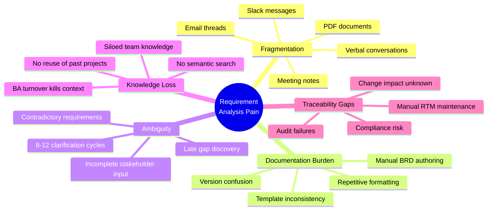

### 2.3 Why Traditional Tools Fail

| Tool | What It Does | What It Cannot Do |
|---|---|---|
| JIRA + Confluence | Stores manually written requirements | Understand, generate, or retrieve semantically |
| Word Templates | Provides formatting structure | Detect gaps, inconsistencies, or missing context |
| Otter.ai | Transcribes meetings | Generate specifications or link to requirements |
| Azure DevOps | Tracks work items | Converse with stakeholders or author BRDs |
| **Chitragupt** | Does all of the above, AI-assisted | — |

### 2.4 The Solution: RAG + Agentic AI

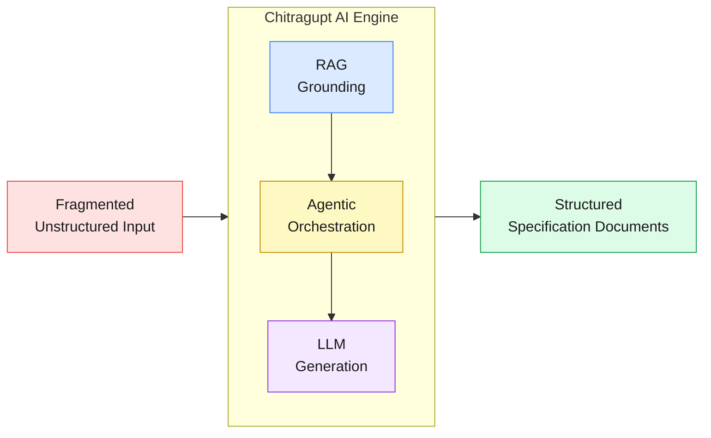

- **LLMs** understand natural language, extract intent, and generate structured outputs
- **RAG** grounds every output in real enterprise documents — reducing hallucinations, ensuring domain relevance
- **Agentic workflows** decompose complex analysis into specialized, collaborative agents with human checkpoints

---

## 3. Problem Space Analysis

### 3.1 Enterprise BA Lifecycle

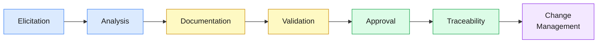

Each phase is **manually intensive and context-dependent**. Chitragupt automates or AI-augments all seven phases.

### 3.2 Industry Trends Supporting This Build

- **Gartner (2025):** 40% of enterprise BA work will be AI-augmented by 2027
- **RAG adoption:** Dominant enterprise AI grounding pattern since 2024; moves LLMs from general to domain-specific
- **Agentic AI:** LangGraph, AutoGen, and CrewAI moving from research to production enterprise deployments
- **Conversational discovery:** GitHub Copilot and Notion AI prove AI-assisted knowledge work is enterprise-ready
- **Market gap:** No purpose-built, AI-first specification generation platform exists at this depth

### 3.3 Competitive Landscape

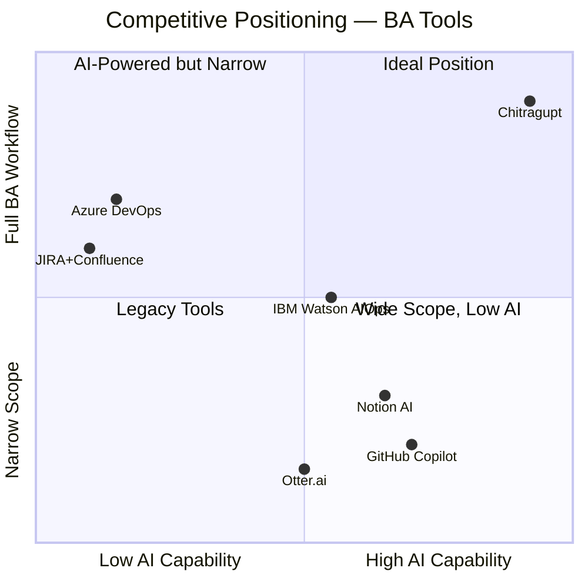

---

## 4. Project Scope

### 4.1 Scope Boundary

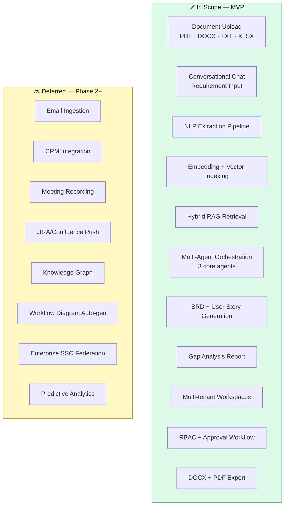

### 4.2 Constraints

| Constraint | Detail |
|---|---|
| **LLM Context Window** | Intelligent chunking and retrieval required; no document can exceed context limits |
| **Data Privacy** | GDPR and SOC2 compliance from day one; no cross-tenant data sharing |
| **LLM Cost** | Response caching, prompt optimization, and model tiering mandatory for scale |
| **Team Size** | Sequential MVP delivery; parallel workstream capacity limited |

### 4.3 Key Assumptions

- Users have existing requirement documents or can provide requirements via chat
- Azure OpenAI (GPT-4o) API is provisioned and available
- Human review is mandatory before any specification is finalized
- At least 2 internal pilot projects are available for MVP validation

---

## 5. System Architecture

### 5.1 High-Level Architecture

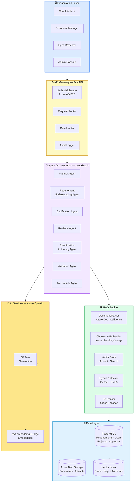

### 5.2 Data Flow — End-to-End

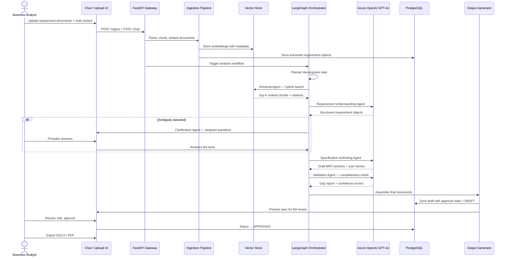

---

## 6. Functional Modules

### 6.1 Module Map

```mermaid
graph LR
    subgraph L1["Layer 1 — Intake"]
        M1[Document Upload]
        M2[Chat Input]
        M3[REST API]
        M4[Email — Ph2]
        M5[Transcripts — Ph2]
    end

    subgraph L2["Layer 2 — Processing"]
        M6[OCR + Parser]
        M7[NLP Extractor]
        M8[Chunker]
        M9[Embedder]
        M10[Indexer]
    end

    subgraph L3["Layer 3 — Retrieval"]
        M11[Dense Search]
        M12[BM25 Keyword]
        M13[RRF Fusion]
        M14[Re-Ranker]
        M15[Source Attribution]
    end

    subgraph L4["Layer 4 — Agents"]
        M16[Planner]
        M17[Understanding]
        M18[Clarification]
        M19[Retrieval]
        M20[Authoring]
        M21[Validation]
        M22[Traceability]
    end

    subgraph L5["Layer 5 — Output"]
        M23[BRD Generator]
        M24[FRD Generator]
        M25[Story Generator]
        M26[Gap Analyser]
        M27[RTM Builder]
        M28[DOCX/PDF Export]
    end

    L1 --> L2 --> L3 --> L4 --> L5

    style L1 fill:#dbeafe,stroke:#3b82f6,color:#1a1a1a
    style L2 fill:#dcfce7,stroke:#16a34a,color:#1a1a1a
    style L3 fill:#fef9c3,stroke:#ca8a04,color:#1a1a1a
    style L4 fill:#f3e8ff,stroke:#9333ea,color:#1a1a1a
    style L5 fill:#fde68a,stroke:#d97706,color:#1a1a1a
```

### 6.2 Intake Layer — Supported Sources

| Source | MVP | Phase 2 | Format |
|---|---|---|---|
| Document Upload | ✅ | — | PDF, DOCX, XLSX, TXT, PPTX |
| Chat / Conversational | ✅ | — | Free text, structured prompts |
| REST API | ✅ | — | JSON, CSV batch |
| Email Ingestion | — | ✅ | EML, MIME, attachments |
| Meeting Transcripts | — | ✅ | TXT, VTT, SRT |
| CRM (Salesforce) | — | ✅ | Opportunity + notes objects |

### 6.3 Output Artifacts

| Artifact | Description | Format |
|---|---|---|
| **BRD** | Business objectives, stakeholders, functional + non-functional requirements, business rules | DOCX, PDF |
| **FRD** | Detailed functional specs, system interfaces, data flows | DOCX, PDF |
| **User Stories** | INVEST-compliant stories with Gherkin acceptance criteria | DOCX, JSON (Ph2) |
| **Gap Analysis** | Missing requirements, completeness gaps, recommendations | DOCX, PDF |
| **RTM** | Full requirement → story → test traceability matrix | XLSX, DOCX |
| **Executive Summary** | One-page stakeholder brief | DOCX, PDF |

---

## 7. RAG Pipeline Design

### 7.1 Why RAG for Chitragupt

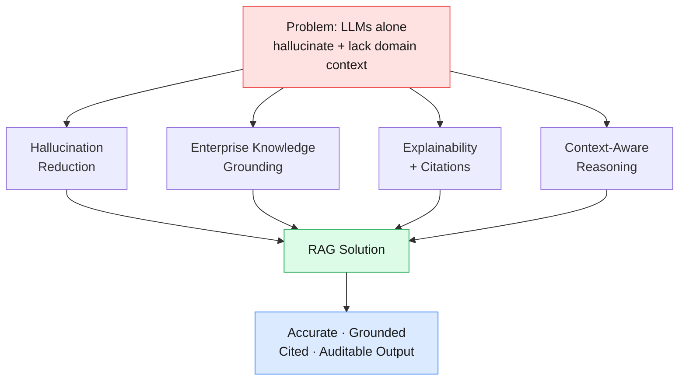

### 7.2 Ingestion Pipeline

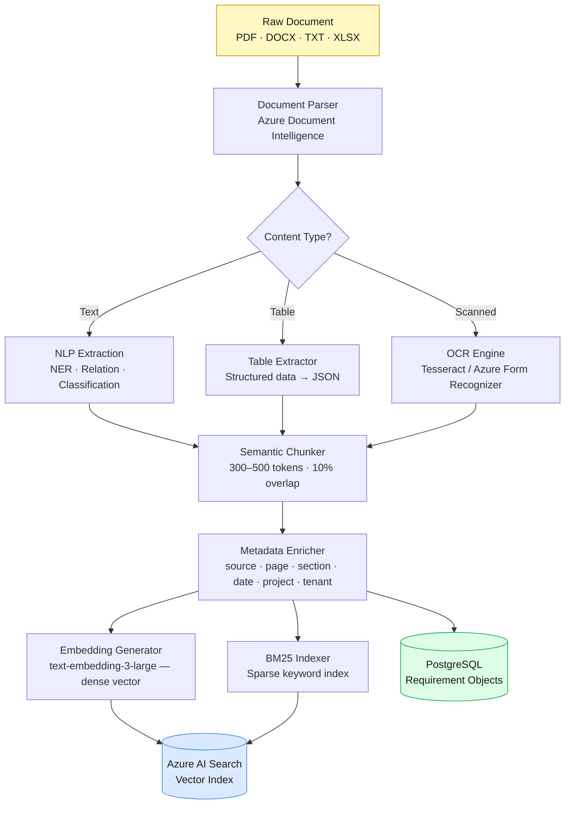

### 7.3 Retrieval Pipeline

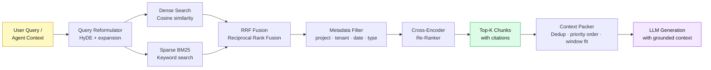

### 7.4 Retrieval Quality Strategy

| Technique | Purpose | Implementation |
|---|---|---|
| **Hybrid Search** | Dense + sparse for broad + precise matching | Azure AI Search (vector + BM25) |
| **RRF Fusion** | Merge ranked lists without score normalization | Custom fusion layer |
| **HyDE** | Generate hypothetical answer to improve query embedding | GPT-4o mini query expansion |
| **Cross-Encoder Re-ranking** | Improve precision of top-K results | FlashRank or Cohere Rerank |
| **Metadata Filtering** | Scope retrieval to relevant project/tenant/date | Vector DB filter predicates |
| **Context Deduplication** | Remove redundant chunks before LLM context packing | Sentence similarity filter |

---

## 8. Agentic Workflow Design

### 8.1 Why Agentic AI for Business Analysis

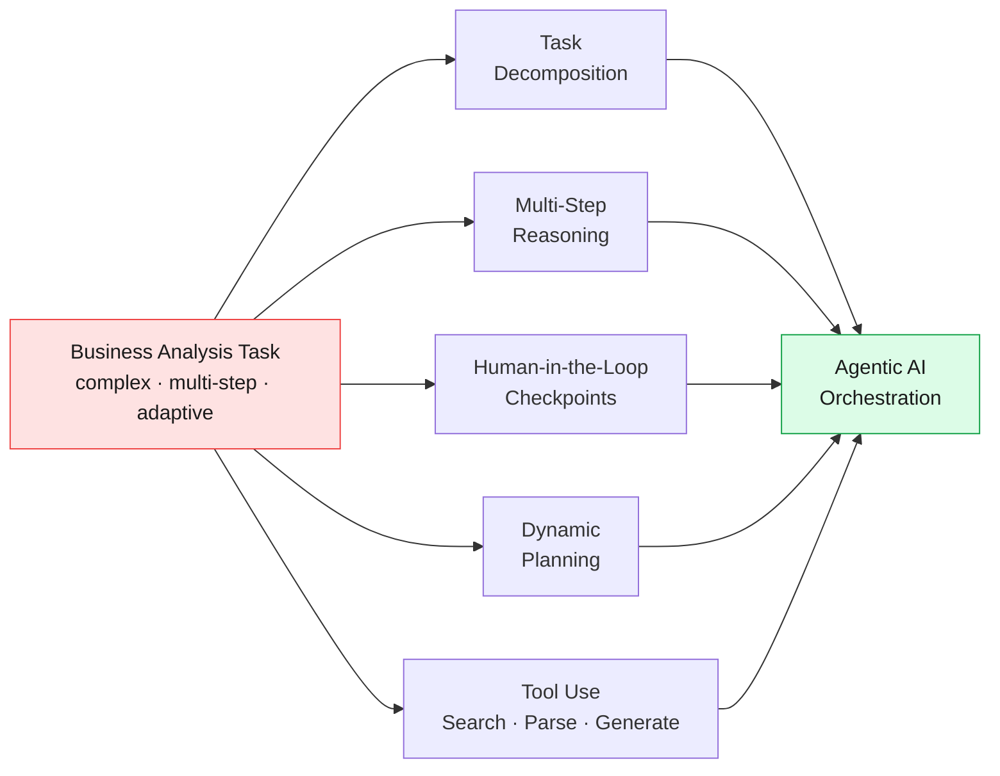

### 8.2 Agent Roster

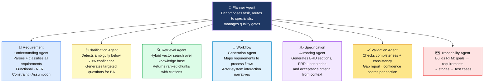

### 8.3 Agent Orchestration Flow (LangGraph State Machine)

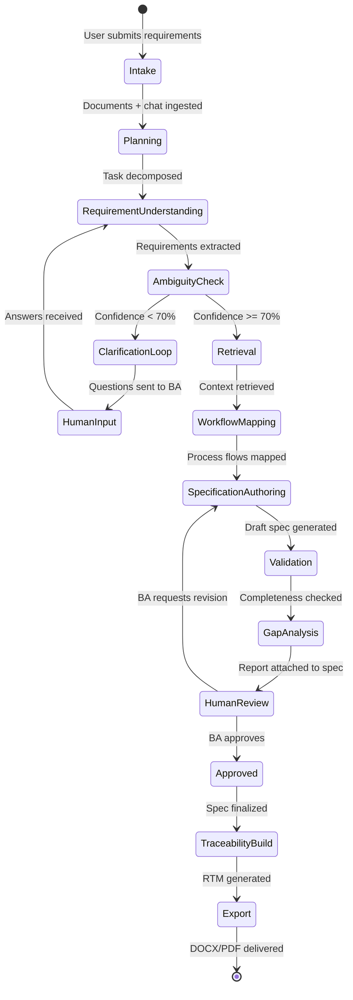

### 8.4 Agent Input/Output Contracts

| Agent | Input | Output | Tools Used |
|---|---|---|---|
| **Planner** | User task, requirements metadata | Sub-task graph, agent routing plan | Task graph builder |
| **Requirement Understanding** | Raw text, document extracts, chat turns | Structured requirement objects (type, priority, actors, entities) | NLP extractor, entity recognizer, classifier |
| **Clarification** | Low-confidence requirement objects | Ordered question list with context | Ambiguity scorer, question generator |
| **Retrieval** | Requirement context, conversation history | Top-K chunks with citations and relevance scores | Hybrid search, re-ranker |
| **Workflow Generation** | Structured requirements, domain context | Process narratives, actor-system maps | Template library, flow generator |
| **Specification Authoring** | Requirements, context, workflow maps, templates | BRD/FRD sections, user stories, ACs | LLM generation, doc template engine |
| **Validation** | Draft spec, original requirements, rubrics | Gap report, confidence scores, suggestions | Coverage checker, consistency validator |
| **Traceability** | Requirements, stories, ACs, test scenarios | RTM, impact maps, orphan alerts | Graph linker, matrix generator |

### 8.5 Architecture Patterns Used

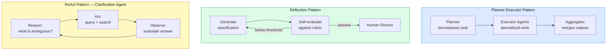

---

## 9. Memory Architecture

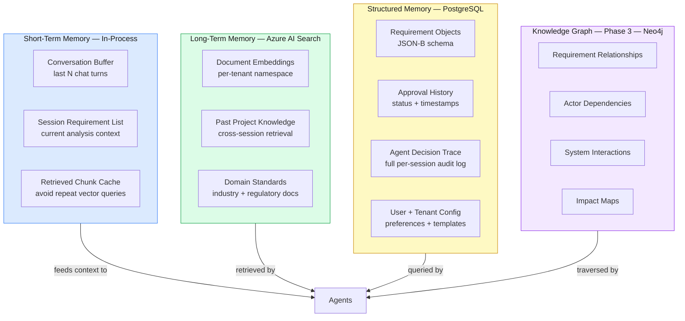

| Memory Type | Scope | Retention | Technology |
|---|---|---|---|
| **Conversational Buffer** | Current session | Session lifetime | In-memory, sliding window |
| **Session Requirement Cache** | Current analysis | Session lifetime | In-memory dict |
| **Enterprise Vector Store** | All sessions, all projects | Permanent per tenant | Azure AI Search |
| **Structured Store** | Project lifetime | Permanent | PostgreSQL + JSONB |
| **Knowledge Graph** | Enterprise-wide | Permanent | Neo4j (Phase 3) |

---

## 10. Use Cases

### 10.1 Use Case Overview

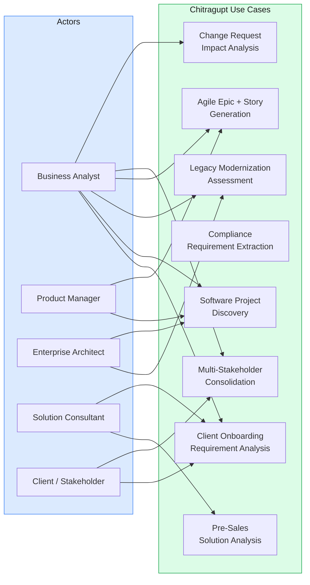

### 10.2 Core Use Case Flows

#### UC1 — Client Onboarding Requirement Analysis

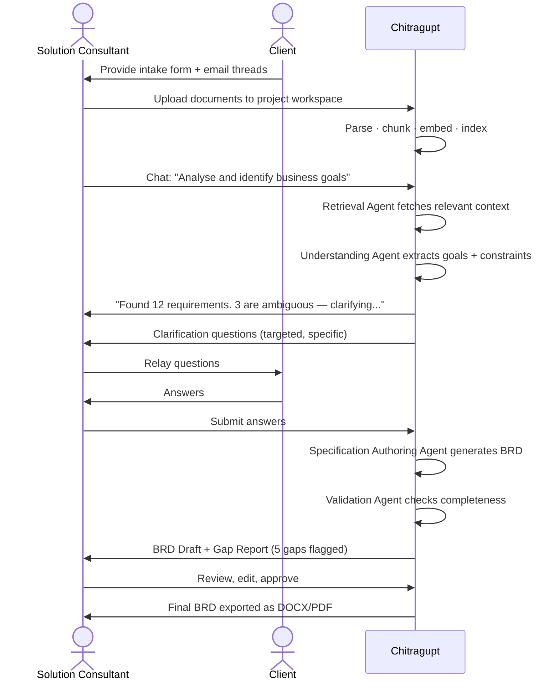

> **Business Value:** Onboarding analysis time reduced from **2 weeks → 2 days**

#### UC5 — Agile Epic and User Story Generation

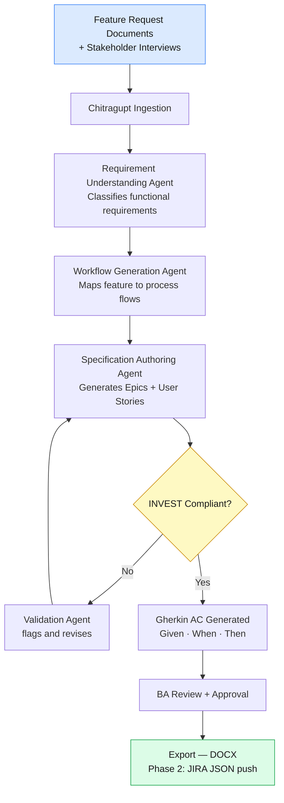

> **Business Value:** Backlog grooming time reduced by **65%**; measurably higher story quality

---

## 11. User Personas

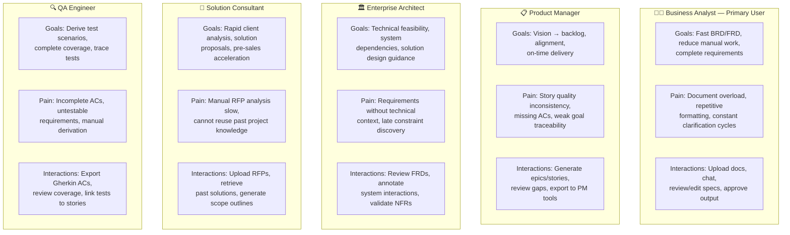

---

## 12. Non-Functional Requirements

### 12.1 NFR Summary

```mermaid
radar
    title NFR Priority Radar
    "Security" : 5
    "Scalability" : 5
    "Data Privacy" : 5
    "Explainability" : 4
    "Reliability" : 5
    "Observability" : 4
    "Latency" : 4
    "Multi-Tenancy" : 5
    "Compliance" : 4
```

### 12.2 Key NFR Targets

| NFR | Target | Mechanism |
|---|---|---|
| **Availability** | 99.9% SLA | Multi-AZ AKS, LLM failover routing |
| **Chat Latency (p95)** | < 5 seconds | Streaming responses, async processing |
| **Ingestion Latency** | < 3 min / 50-page PDF | Async queue (Azure Service Bus) |
| **Spec Generation** | < 90 seconds for 20 requirements | Parallel agent execution |
| **Vector Retrieval (p95)** | < 500 ms | Azure AI Search optimized indexing |
| **Tenant Isolation** | Zero cross-tenant leakage | Namespace isolation at every layer |
| **Encryption** | AES-256 at rest, TLS 1.3 in transit | Azure Key Vault + managed certs |
| **Auth** | OAuth 2.0 / JWT + MFA | Azure AD B2C |
| **Compliance** | SOC2 T2, GDPR, ISO 27001 | Annual audit, DPA support |
| **Observability** | Distributed tracing + LLM metrics | OpenTelemetry + LangSmith |

### 12.3 Security Threat Model

```mermaid
graph TD
    T1[Prompt Injection\nvia malicious documents] --> M1[Input sanitization\n+ system prompt isolation\n+ content filtering layer]
    T2[Cross-tenant\ndata leakage] --> M2[Namespace enforcement\n+ access control layers\n+ penetration testing]
    T3[LLM API\ncredential exposure] --> M3[Azure Key Vault\n+ short-lived tokens\n+ key rotation]
    T4[Hallucinated\nspecifications] --> M4[RAG grounding\n+ Validation Agent\n+ mandatory human review]
    T5[Unauthorized\nspecification access] --> M5[RBAC enforcement\n+ JWT session management\n+ audit logging]

    style T1 fill:#fee2e2,stroke:#ef4444,color:#1a1a1a
    style T2 fill:#fee2e2,stroke:#ef4444,color:#1a1a1a
    style T3 fill:#fee2e2,stroke:#ef4444,color:#1a1a1a
    style T4 fill:#fef9c3,stroke:#ca8a04,color:#1a1a1a
    style T5 fill:#fee2e2,stroke:#ef4444,color:#1a1a1a
    style M1 fill:#dcfce7,stroke:#16a34a,color:#1a1a1a
    style M2 fill:#dcfce7,stroke:#16a34a,color:#1a1a1a
    style M3 fill:#dcfce7,stroke:#16a34a,color:#1a1a1a
    style M4 fill:#dcfce7,stroke:#16a34a,color:#1a1a1a
    style M5 fill:#dcfce7,stroke:#16a34a,color:#1a1a1a
```

---

## 13. Technology Stack

```mermaid
graph TB
    subgraph FE["Frontend"]
        F1[React + TypeScript\nChat UI · Doc Manager · Spec Reviewer]
    end

    subgraph BE["Backend"]
        B1[FastAPI — Python\nAgent gateway · Auth · Routing]
        B2[LangGraph\nStateful multi-agent orchestration]
    end

    subgraph AI["AI Services"]
        A1[Azure OpenAI GPT-4o\nGeneration · Reasoning · Validation]
        A2[text-embedding-3-large\nDense vector embeddings]
        A3[FlashRank / Cohere Rerank\nCross-encoder re-ranking]
    end

    subgraph STORE["Data Stores"]
        S1[Azure AI Search\nHybrid vector + BM25 index]
        S2[PostgreSQL\nRequirements · Users · Approvals · Audit]
        S3[Azure Blob Storage\nDocuments · Generated artifacts]
    end

    subgraph INFRA["Infrastructure"]
        I1[Azure Kubernetes Service\nAKS — containerized microservices]
        I2[Azure AD B2C\nAuth · MFA · RBAC]
        I3[Azure Key Vault\nSecrets · API keys · Certs]
        I4[Azure Service Bus\nAsync ingestion queue]
    end

    subgraph OBS["Observability"]
        O1[LangSmith\nLLM call tracing · token usage · costs]
        O2[Azure Monitor\nSystem metrics · alerting]
        O3[OpenTelemetry\nDistributed tracing across agents]
    end

    FE --> BE
    BE --> AI
    BE --> STORE
    BE --> INFRA
    BE --> OBS

    style FE fill:#dbeafe,stroke:#3b82f6,color:#1a1a1a
    style BE fill:#fef9c3,stroke:#ca8a04,color:#1a1a1a
    style AI fill:#f3e8ff,stroke:#9333ea,color:#1a1a1a
    style STORE fill:#dcfce7,stroke:#16a34a,color:#1a1a1a
    style INFRA fill:#e0f2fe,stroke:#0284c7,color:#1a1a1a
    style OBS fill:#fde68a,stroke:#d97706,color:#1a1a1a
```

| Layer | Primary Choice | Alternatives |
|---|---|---|
| LLM | Azure OpenAI GPT-4o | Anthropic Claude Sonnet 4.6, Gemini 1.5 Pro |
| Embedding | text-embedding-3-large | Cohere Embed v3, BGE-M3 |
| Vector DB | Azure AI Search (hybrid) | Pinecone, Weaviate, Qdrant |
| Agent Orchestration | LangGraph | LangChain, AutoGen, CrewAI |
| Document Parsing | Azure Document Intelligence | PyMuPDF, Unstructured.io |
| Backend | FastAPI (Python) | Node.js Express |
| Frontend | React + TypeScript | Next.js |
| Auth | Azure AD B2C | Auth0, Keycloak |
| Database | PostgreSQL + pgvector | MongoDB Atlas |
| Observability | LangSmith + Azure Monitor | Langfuse, Datadog |
| Container Orchestration | AKS (Kubernetes) | AWS EKS |
| Knowledge Graph (Ph3) | Neo4j | Azure Cosmos DB Gremlin |

---

## 14. Risks & Mitigations

```mermaid
graph LR
    subgraph CRITICAL["🔴 Critical Risk"]
        R1[LLM Hallucinations\nin specifications]
        R2[Prompt Injection\nvia documents]
        R3[Data Privacy\nBreach]
    end

    subgraph HIGH["🟠 High Risk"]
        R4[Poor Retrieval\nQuality]
        R5[High LLM API\nCosts at Scale]
        R6[User Over-Reliance\non AI Output]
        R7[Poor User\nAdoption]
    end

    subgraph MEDIUM["🟡 Medium Risk"]
        R8[Context Drift in\nLong Conversations]
        R9[Enterprise Integration\nFailures]
    end

    R1 --> M1["RAG grounding +\nValidation Agent +\nhuman review gate"]
    R2 --> M2["Input sanitization +\nsystem prompt isolation +\ncontent filtering"]
    R3 --> M3["Tenant isolation +\nencryption + access\ncontrols + pen-test"]
    R4 --> M4["Hybrid search +\ncross-encoder re-rank +\nretrieval metrics"]
    R5 --> M5["Response caching +\nmodel tiering +\nprompt optimization"]
    R6 --> M6["Mandatory review gates +\nconfidence score display +\nBA training"]
    R7 --> M7["Intuitive UX +\nonboarding guides +\nROI dashboards"]
    R8 --> M8["Sliding window memory +\nperiodic context summarization"]
    R9 --> M9["Retry + backoff +\nmanual fallback +\nalert on failure"]

    style CRITICAL fill:#fee2e2,stroke:#ef4444,color:#1a1a1a
    style HIGH fill:#fed7aa,stroke:#ea580c,color:#1a1a1a
    style MEDIUM fill:#fef9c3,stroke:#ca8a04,color:#1a1a1a
```

---

## 15. MVP Recommendation

### 15.1 MVP Value Loop

```mermaid
flowchart LR
    A[Ingest Requirements\nDoc upload + chat] --> B[AI Analysis\n3 core agents]
    B --> C[Generate Specification\nBRD + User Stories]
    C --> D[Human Review\nEdit + Approve]
    D --> E[Export\nDOCX + PDF]
    E -.->|Next project| A

    style A fill:#dbeafe,stroke:#3b82f6,color:#1a1a1a
    style B fill:#f3e8ff,stroke:#9333ea,color:#1a1a1a
    style C fill:#dcfce7,stroke:#16a34a,color:#1a1a1a
    style D fill:#fef9c3,stroke:#ca8a04,color:#1a1a1a
    style E fill:#fde68a,stroke:#d97706,color:#1a1a1a
```

### 15.2 MVP Feature Set

| # | Feature | Priority |
|---|---|---|
| 1 | Document upload: PDF, DOCX, TXT (up to 50 MB, batch) | P0 |
| 2 | Chat-based conversational requirement input | P0 |
| 3 | NLP extraction + semantic chunking + embedding | P0 |
| 4 | Azure AI Search hybrid vector store | P0 |
| 5 | Requirement Understanding Agent | P0 |
| 6 | Specification Authoring Agent (BRD + User Stories) | P0 |
| 7 | Validation Agent + Gap Analysis Report | P0 |
| 8 | Source citations in all generated outputs | P0 |
| 9 | DOCX + PDF export | P0 |
| 10 | Project workspace with multi-user access | P1 |
| 11 | RBAC: Admin, Business Analyst, Reviewer | P1 |
| 12 | Approval workflow: Draft → In Review → Approved | P1 |
| 13 | Basic audit log | P1 |

### 15.3 12-Week Delivery Plan

```mermaid
gantt
    title Chitragupt MVP — 12-Week Delivery Plan
    dateFormat  YYYY-MM-DD
    section Infrastructure
    Azure provisioning (IaC/Terraform)     :2026-06-01, 1w
    LLM + Azure AD auth integration        :2026-06-01, 2w
    section Ingestion
    Document parsing + NLP extraction      :2026-06-08, 2w
    Semantic chunking + embedding pipeline :2026-06-08, 2w
    section RAG
    Azure AI Search hybrid index           :2026-06-22, 1w
    Retrieval pipeline + metadata filter   :2026-06-22, 2w
    section Agents
    Requirement Understanding Agent        :2026-07-06, 2w
    Specification Authoring Agent + BRD    :2026-07-06, 2w
    Validation Agent + Gap Report          :2026-07-20, 2w
    section UX + Integration
    Chat UI + Document Manager             :2026-07-20, 2w
    Project workspace + RBAC               :2026-07-20, 2w
    DOCX/PDF export + approval workflow    :2026-07-27, 1w
    section Launch
    Security hardening + audit log         :2026-08-03, 1w
    Pilot deployment (2 projects)          :2026-08-10, 1w
    User acceptance testing                :2026-08-10, 1w
```

### 15.4 MVP Success Criteria

- ✅ Process a 20-page requirements document and generate a complete BRD draft in **< 90 seconds**
- ✅ **≥ 80%** of AI-generated requirements rated accurate by BA reviewers during pilot
- ✅ **3+ internal projects** analyzed using the platform in pilot phase
- ✅ BA/PM pilot **NPS > 50**
- ✅ **Zero critical security vulnerabilities** in penetration test before production release

---

## 16. Product Roadmap

```mermaid
timeline
    title Chitragupt Product Roadmap — 12 Months
    section Phase 1 — MVP (Months 1–3)
        Core Intelligence : Document ingestion
                          : Chat-based intake
                          : RAG retrieval pipeline
                          : 3-agent orchestration
                          : BRD + User Story generation
                          : DOCX/PDF export
    section Phase 2 — Integrations (Months 4–6)
        Enterprise Enrichment : Email ingestion
                              : Meeting transcript processing
                              : JIRA + Confluence integration
                              : Clarification Agent
                              : Traceability Agent
                              : FRD + Gap analysis
                              : Workflow diagram generation
    section Phase 3 — Scale (Months 7–9)
        Enterprise Scale : Knowledge graph (Neo4j)
                         : Multi-stakeholder consolidation
                         : Enterprise SSO federation
                         : CRM integration (Salesforce)
                         : Multi-language support
                         : Advanced analytics dashboard
    section Phase 4 — Autonomous (Months 10–12)
        Intelligent Autonomy : AI-driven MoSCoW prioritization
                             : Predictive scope risk analysis
                             : Self-improving retrieval
                             : Azure DevOps integration
                             : Industry templates
                             : Autonomous discovery
```

---

## 17. Epics & User Stories

### 17.1 Epic Map

```mermaid
graph TD
    subgraph P0["P0 — Must Have (MVP)"]
        E1[E1: Platform Setup\n+ Infrastructure]
        E2[E2: Document\nIngestion]
        E3[E3: RAG Retrieval\nPipeline]
        E4[E4: Agent\nOrchestration]
        E5[E5: Output\nGeneration]
    end

    subgraph P1["P1 — Should Have (MVP)"]
        E6[E6: Conversational\nRequirement Intake]
        E7[E7: UX + Workspace]
        E8[E8: Security\n+ Administration]
    end

    subgraph P2["P2 — Phase 2"]
        E9[E9: Integration\nLayer]
        E10[E10: Analytics\n+ Observability]
    end

    E1 --> E2 --> E3 --> E4 --> E5

    style P0 fill:#dcfce7,stroke:#16a34a,color:#1a1a1a
    style P1 fill:#dbeafe,stroke:#3b82f6,color:#1a1a1a
    style P2 fill:#fef9c3,stroke:#ca8a04,color:#1a1a1a
```

### 17.2 Selected User Stories

#### Epic 1 — Platform Setup & Infrastructure
> **US-1.1** As a DevOps Engineer, I want to provision all Azure infrastructure via Terraform so that environments are reproducible and version-controlled.  
> **AC:** All resources in Terraform; staging/prod isolated; changes tracked in git; health check endpoint responds 200.

> **US-1.2** As a System Admin, I want tenant provisioning to create isolated namespaces in vector DB, storage, and database so that new clients are onboarded in < 30 minutes.  
> **AC:** Tenant creation API creates isolated namespaces; tenant admin user provisioned; no cross-tenant data access possible.

#### Epic 2 — Document Ingestion
> **US-2.1** As a Business Analyst, I want to upload PDF and DOCX requirement documents so that Chitragupt can extract and process the requirements automatically.  
> **AC:** Files up to 50 MB; upload progress visible; extraction status shown; completion within 3 minutes for 50-page PDF.

> **US-2.2** As a Business Analyst, I want to preview extracted text and detected entities so that I can verify extraction quality before analysis.  
> **AC:** Preview shown within 30 seconds; page count, section headers, detected entities, and confidence score displayed.

#### Epic 3 — RAG Retrieval Pipeline
> **US-3.1** As the System, I want hybrid search (dense + BM25) over the project knowledge base so that the most contextually relevant chunks are retrieved for specification generation.  
> **AC:** Top-10 relevant chunks returned; hybrid search shows > 15% precision improvement vs vector-only in A/B evaluation.

> **US-3.2** As a Business Analyst, I want source citations (document, section, page) on every generated spec section so that I can trace and verify AI outputs.  
> **AC:** Citations present on all generated sections; citations link back to source document preview.

#### Epic 4 — Agent Orchestration
> **US-4.1** As the System, I want the Requirement Understanding Agent to classify requirements by type with > 85% accuracy so that downstream agents receive clean structured input.  
> **AC:** Classification into Functional / NFR / Constraint / Assumption; ≥ 85% accuracy vs. human expert baseline on test set.

> **US-4.2** As the System, I want the Specification Authoring Agent to generate a complete BRD draft within 90 seconds for 20 requirements.  
> **AC:** All major BRD sections populated; source citations throughout; generation completes in < 90s.

> **US-4.3** As the System, I want the Validation Agent to flag gaps and assign confidence scores per section so that BAs can focus review on weak areas.  
> **AC:** ≥ 90% of known gaps identified in test scenarios; confidence score shown per section; specific remediation suggestions provided.

#### Epic 5 — Output Generation
> **US-5.1** As a Business Analyst, I want to export a professionally formatted BRD as DOCX so that I have an enterprise-grade deliverable.  
> **AC:** DOCX with TOC, numbered headings, formatted tables, page numbers; opens correctly in Microsoft Word.

> **US-5.2** As a Product Manager, I want INVEST-compliant user stories with Gherkin acceptance criteria generated from requirements.  
> **AC:** Stories follow "As a [role], I want [goal] so that [value]"; ACs in Given/When/Then format; stories organized into epics.

#### Epic 6 — Conversational Intake
> **US-6.1** As a Business Analyst, I want to describe requirements through a chat interface with context retained across turns so that I can provide detail not in documents.  
> **AC:** Multi-turn conversation; history retained; AI responds in < 5 seconds; conversation stored for retrieval.

> **US-6.2** As a Business Analyst, I want Chitragupt to ask specific clarifying questions when requirements are ambiguous so that generated specs are accurate.  
> **AC:** Clarification triggered for requirements below 70% confidence; questions are specific, actionable, and reference the ambiguous requirement directly.

#### Epic 7 — UX & Workspace
> **US-7.1** As a Business Analyst, I want project workspaces to isolate different client requirements so that there is no cross-project contamination.  
> **AC:** Project create/rename/archive; documents and specs isolated per project; access restricted to authorized members.

> **US-7.2** As a Business Analyst, I want inline editing and approval workflow (Draft → In Review → Approved) for AI-generated specs so that I maintain editorial control.  
> **AC:** All sections editable inline; status tracked through workflow states; change history with user + timestamp logged.

#### Epic 8 — Security & Administration
> **US-8.1** As a Security Admin, I want MFA-enforced Azure AD authentication with 30-minute session timeout.  
> **AC:** Azure AD B2C operational; MFA enforced; session expires at 30 minutes inactivity; refresh token rotation enabled.

> **US-8.2** As a Compliance Officer, I want an immutable audit log of all AI outputs, user actions, and document accesses for SOC 2 audit readiness.  
> **AC:** Audit log captures user ID, timestamp, action type, resource; immutable; exportable as CSV; configurable retention.

---

## 18. Success Metrics

### 18.1 Metric Dashboard

```mermaid
graph TD
    subgraph OPS["⚙️ Operational KPIs"]
        O1["BRD Generation\n3–5 days → < 4 hours"]
        O2["Requirement Processing\n2–4 hrs → < 15 min"]
        O3["Clarification Cycles\n8–12 → < 3 rounds"]
        O4["Spec Accuracy\n> 85% BA approval rate"]
        O5["Retrieval MRR@10\n> 0.75"]
        O6["Story INVEST Quality\n> 80% on first gen"]
    end

    subgraph BIZ["📈 Business KPIs"]
        B1["BA Productivity\n60% time reduction"]
        B2["Platform Adoption\n80% BAs within 3 months"]
        B3["Onboarding Time\n50% reduction"]
        B4["Rework Rate\n< 20% major revisions"]
        B5["User NPS\n> 50"]
    end

    subgraph TECH["🔧 Technical KPIs"]
        T1["Uptime: 99.9%"]
        T2["Chat Latency p95: < 5s"]
        T3["Ingestion: < 3 min/50pp"]
        T4["Spec Gen: < 90s"]
        T5["Hallucination Rate: < 5%"]
        T6["Vector Latency p95: < 500ms"]
        T7["LLM Cost/BRD: < $0.50"]
    end
```

### 18.2 KPI Targets

| Metric | Baseline (Manual) | MVP Target | Measurement |
|---|---|---|---|
| BRD Generation Time | 3–5 business days | < 4 hours | Timestamp: trigger → DOCX ready |
| Requirement Processing | 2–4 hrs / document | < 15 minutes | Ingestion pipeline telemetry |
| Clarification Cycles | 8–12 rounds / project | < 3 rounds | Conversation analytics |
| Spec Accuracy (BA Rating) | N/A | > 85% approved without major revision | BA feedback scoring post-review |
| Retrieval MRR@10 | N/A | > 0.75 | Automated evaluation pipeline |
| Story INVEST Compliance | N/A | > 80% on first generation | QA review checklist |
| Gap Detection Rate | N/A | > 90% of known gaps | Controlled test scenario evaluation |
| System Uptime | N/A | 99.9% monthly | Azure Monitor |
| Chat Response (p95) | N/A | < 5 seconds | API gateway latency metrics |
| LLM Hallucination Rate | N/A | < 5% of sections flagged | Validation Agent output analytics |

### 18.3 Review Cadence

| Cadence | Review | Owner |
|---|---|---|
| **Weekly** | Technical KPIs: latency, uptime, error rates, ingestion success | Engineering Lead |
| **Bi-weekly** | Retrieval quality: precision, recall, MRR trends, improvement actions | AI/ML Lead |
| **Monthly** | Business KPIs: adoption, productivity improvement, NPS, rework rate | Product + Delivery |
| **Quarterly** | Full platform health, roadmap progress, user feedback synthesis, competitive positioning | Leadership |

---

## Appendix A — Glossary

| Term | Definition |
|---|---|
| **BRA** | Business Requirement Analyzer — the functional role Chitragupt fulfills |
| **BRD** | Business Requirements Document — primary output artifact |
| **FRD** | Functional Requirements Document — detailed technical specification |
| **RAG** | Retrieval-Augmented Generation — grounds LLM output in retrieved enterprise documents |
| **RTM** | Requirement Traceability Matrix — links business goals → requirements → stories → tests |
| **INVEST** | Independent, Negotiable, Valuable, Estimable, Small, Testable — user story quality criteria |
| **RRF** | Reciprocal Rank Fusion — algorithm to merge ranked results from multiple search indices |
| **HyDE** | Hypothetical Document Embedding — technique to improve retrieval by generating a hypothetical answer first |
| **NFR** | Non-Functional Requirement — quality attributes: performance, security, scalability, etc. |
| **HITL** | Human-in-the-Loop — design pattern requiring human approval at defined AI workflow checkpoints |
| **MoSCoW** | Must have, Should have, Could have, Won't have — requirement prioritization framework |

---

## Appendix B — Agent Quick Reference

| Agent | Trigger | Output | Human Gate? |
|---|---|---|---|
| **Planner** | New analysis task received | Sub-task graph, routing plan | No |
| **Requirement Understanding** | Documents / chat ingested | Typed, structured requirement objects | No |
| **Clarification** | Confidence < 70% on any requirement | Targeted question list | **Yes** — BA must answer |
| **Retrieval** | Context needed for generation | Ranked chunks with citations | No |
| **Workflow Generation** | Requirements structured and confirmed | Process flow narratives, actor maps | No |
| **Specification Authoring** | Context + requirements ready | Draft BRD/FRD/Stories with citations | No |
| **Validation** | Draft spec complete | Gap report, confidence scores, suggestions | No |
| **Traceability** | Spec approved by BA | RTM, impact maps, orphan alerts | No |

---

*Chitragupt — the keeper of complete accounts.*  
*Document maintained by: Product & Architecture Team, Aligned Automation*  
*Version 1.0 | May 2026 | Confidential — Internal Use Only*
