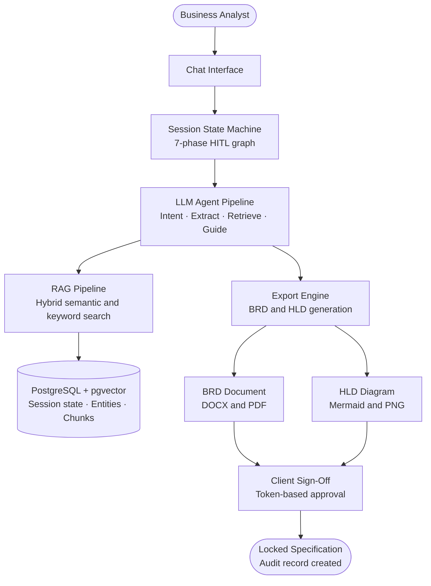

# Flow 01 — System Overview

## What this covers

Chitragupt is an AI-powered Business Requirement Analyzer. A Business Analyst (BA) opens a chat session, the system guides them through seven structured phases, ingests any documents they upload, and produces a signed-off BRD and High-Level Architecture Diagram.

This diagram shows the top-level picture — what enters the system, what processes it, and what comes out.

## Important Components

| Component | Role |
|---|---|
| BA Chat Interface | The only way the BA interacts with the system |
| Session State Machine | Tracks which phase the session is in |
| LLM Agent Pipeline | Reasoning engine behind every response |
| RAG Pipeline | Retrieves relevant content from uploaded documents |
| PostgreSQL + pgvector | Stores all session data, entities, and embeddings |
| Export Engine | Generates the final BRD and HLD artifacts |

## Input → Process → Output

- **Input:** BA messages and document uploads
- **Process:** Structured, phase-by-phase guided conversation with AI extraction and retrieval
- **Output:** Signed-off BRD (DOCX/PDF) and HLD diagram (Mermaid/PNG), locked in object storage

## Diagram

---

> Chitragupt · Flow 01 of 11 · May 2026
