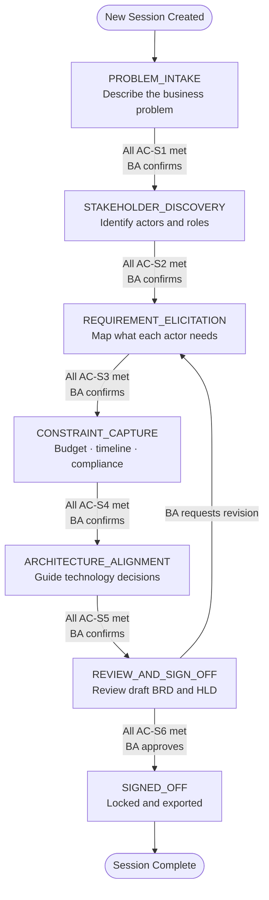

# Flow 02 — BA Session State Machine

## What this covers

The session advances through seven phases in order. The BA can never be moved forward automatically — every transition requires the BA to explicitly confirm. The BA can also revisit any prior phase at any time without losing what was already captured.

**Key rule:** Every state has Acceptance Criteria (AC). All AC must pass before the system even offers a transition. If the BA says "let's move on" before AC are met, the system surfaces the unmet criteria explicitly.

## Important Components

| Component | Role |
|---|---|
| `SessionState` | Typed object that holds all captured data for the session |
| `TransitionHandler` | Proposes transitions and awaits BA confirmation |
| Acceptance Criteria (AC) | Discrete, programmatically checkable conditions per state |
| REVISIT handler | Re-enters a prior state and resumes from the last unmet criterion |
| `GapAnalyzerAgent` | Evaluates which AC are unmet after every turn |

## Input → Process → Output

- **Input:** BA natural language messages and confirmation responses
- **Process:** After every turn, all AC for the current state are evaluated; transition is offered only when all pass and BA confirms
- **Output:** Session advances to the next state; all captured data is persisted to PostgreSQL

## Diagram

## Output Artifacts per Phase

| Phase | What gets produced |
|---|---|
| PROBLEM_INTAKE | Problem Statement card |
| STAKEHOLDER_DISCOVERY | Actor Registry |
| REQUIREMENT_ELICITATION | Draft Requirements List with confidence tags |
| CONSTRAINT_CAPTURE | Constraint and Assumption Register |
| ARCHITECTURE_ALIGNMENT | Decision Direction Summary |
| REVIEW_AND_SIGN_OFF | Draft BRD + HLD |
| SIGNED_OFF | Locked BRD export (DOCX/PDF/Markdown) + Audit record |

---

> Chitragupt · Flow 02 of 11 · May 2026
