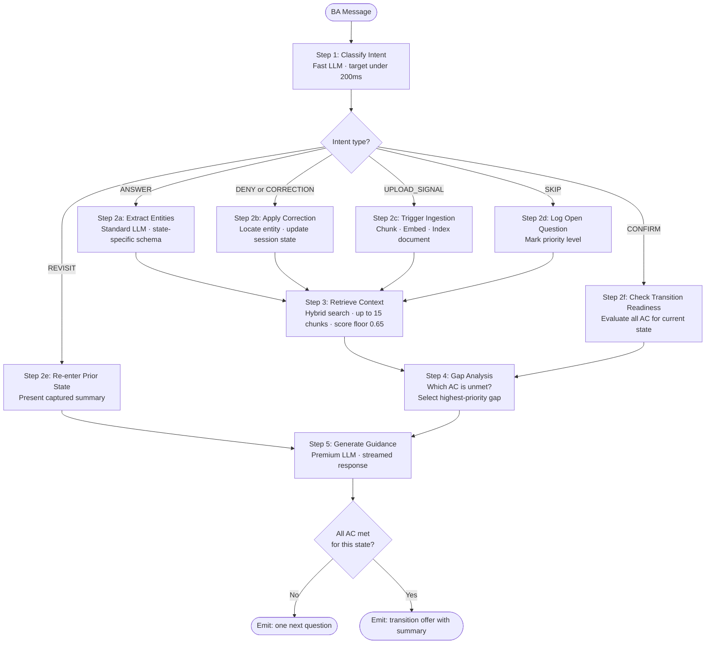

# Flow 03 — Per-Turn LLM Pipeline

## What this covers

Every message the BA sends triggers a six-step pipeline before a response is generated. No step can be skipped. The final output always ends with exactly one clear action for the BA — a question, a confirmation prompt, or a transition offer.

**Design principle:** The BA should never wonder "what do I do next?" — that is a system failure.

## Important Components

| Agent | Model Tier | Role |
|---|---|---|
| `IntentClassifierAgent` | Fast LLM | Classifies what the BA meant (target: < 200ms) |
| `EntityExtractorAgent` | Standard LLM | Pulls structured data from the BA's words |
| `RAGRetrievalAgent` | — (retrieval) | Hybrid search over all session documents |
| `GapAnalyzerAgent` | Standard LLM | Checks which acceptance criteria are still unmet |
| `GuidanceGeneratorAgent` | Premium LLM | Composes the final response (streamed) |

## Intent Types

| Intent | When it fires |
|---|---|
| `ANSWER` | BA is providing new information |
| `CONFIRM` | BA accepts a system summary or proposal |
| `DENY / CORRECTION` | BA rejects or corrects something |
| `UPLOAD_SIGNAL` | BA mentions a file or document |
| `REVISIT` | BA wants to go back to a prior phase |
| `SKIP` | BA wants to move on without answering |
| `CLARIFICATION_REQUEST` | BA is asking the system a question |
| `UPLOAD_COMPLETE` | System event after successful document ingestion |
| `OUT_OF_SCOPE` | BA message is off-topic |

## Input → Process → Output

- **Input:** Any BA message
- **Process:** Classify intent → extract or handle → retrieve → analyze gaps → generate response
- **Output:** Streamed system message — acknowledge + captured bullets + one next action

## Diagram



## Response Format (Every Turn)

```
[Acknowledgment — 1 sentence]
What the system heard from the BA, paraphrased.

[Captured — 0 to 3 bullets]
• What was extracted and added to the session.

[Next action — 1 sentence only]
Exactly one clear question or transition offer.
```

---

> Chitragupt · Flow 03 of 11 · May 2026
