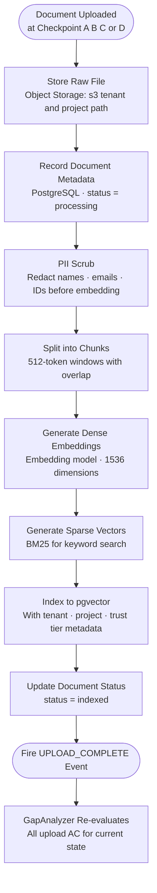

# Flow 04 — Document Ingestion Pipeline

## What this covers

When a BA uploads a document at any checkpoint, it passes through a processing pipeline before its content becomes searchable. PII scrubbing always happens before embedding — never after. Every chunk is tagged with the tenant and project IDs to enforce strict data isolation.

**Key rule (INV-SEC-02):** PII is scrubbed before any embedding call. The order is fixed — scrub then embed, never the reverse.

## Important Components

| Component | Role |
|---|---|
| Object Storage | Raw files stored at `s3://{tenant_id}/{project_id}/` |
| PII Scrubber | Redacts personal identifiers before any embedding |
| Chunker | Splits documents into 512-token overlapping windows |
| Embedding Model | Converts text to dense 1536-dimension vectors |
| BM25 Sparse Generator | Produces keyword-match vectors alongside dense embeddings |
| pgvector | Stores both dense and sparse vectors with metadata filters |
| `UPLOAD_COMPLETE` event | Fires after successful indexing; triggers AC re-evaluation |

## Supported File Types

`pdf` · `docx` · `txt` · `md` · `xlsx` · `image` · `audio` · `confluence_url` · `jira_epic` · `notion_page` · `web_url`

## Input → Process → Output

- **Input:** Raw uploaded file at any checkpoint (A, B, C, or D)
- **Process:** Store → record metadata → scrub PII → chunk → embed → index → notify
- **Output:** Searchable chunks in pgvector; upload acceptance criteria re-evaluated by GapAnalyzer

## Diagram



## Chunk Metadata Stored per Vector

Every chunk stored in pgvector carries this metadata envelope for filtered retrieval:

```
chunk_id       · document_id   · project_id    · tenant_id
source_type    · trust_tier    · page_number   · section_title
valid_from     · valid_until   · is_active     · confidence_modifier
```

**Mandatory filters applied to every retrieval query:**
- `tenant_id == {current_tenant_id}`
- `project_id == {current_project_id}`
- `is_active == true`
- `valid_until IS NULL OR valid_until > NOW()`

---

> Chitragupt · Flow 04 of 11 · May 2026
