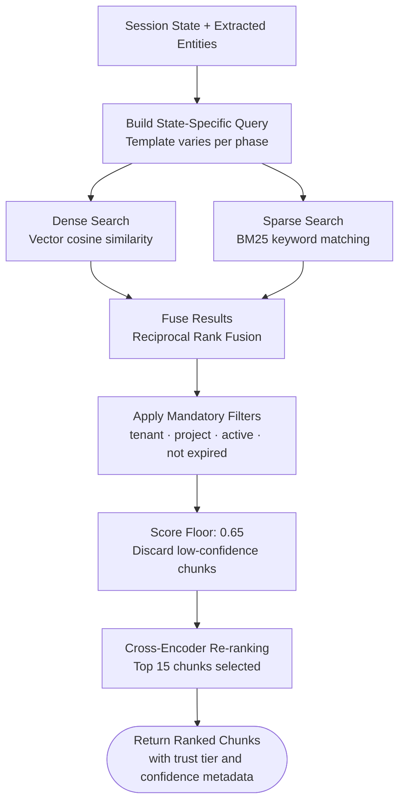

# Flow 05 — RAG Retrieval Flow

## What this covers

From the STAKEHOLDER_DISCOVERY phase onward, every pipeline turn includes a retrieval step. The system builds a query from the current session state and extracted entities, runs it through both a dense (semantic) and sparse (keyword) search, fuses the results, applies mandatory filters, and re-ranks before returning chunks to the GapAnalyzer and GuidanceGenerator.

**Key rule:** Every query must include four mandatory filters — `tenant_id`, `project_id`, `is_active = true`, and `valid_until IS NULL OR > NOW()`. Omitting any filter is a critical defect (INV-SEC-01).

## Important Components

| Component | Role |
|---|---|
| State-specific query templates | Different query patterns per session phase |
| Dense search | Vector cosine similarity against pgvector index |
| Sparse search (BM25) | Keyword-based matching for exact terms and named entities |
| RRF fusion | Reciprocal Rank Fusion combines both result sets |
| Cross-encoder re-ranker | Orders final results by contextual relevance |
| Mandatory filters | Enforce tenant and project isolation on every query |

## Input → Process → Output

- **Input:** Current session state + entities extracted this turn
- **Process:** Build query → dual-path search → fuse → filter → score floor → re-rank
- **Output:** Up to 15 ranked chunks with source metadata, passed to GapAnalyzer and GuidanceGenerator

## Diagram

## State-Specific Query Templates

| Phase | Query template used |
|---|---|
| PROBLEM_INTAKE | No retrieval — no documents yet |
| STAKEHOLDER_DISCOVERY | `{problem_statement} stakeholders actors roles responsibilities` |
| REQUIREMENT_ELICITATION | `{actor_name} needs requirements workflows` — one query per actor |
| CONSTRAINT_CAPTURE | `budget timeline compliance regulatory constraints {domain}` |
| ARCHITECTURE_ALIGNMENT | `{decision_id} {constraint_summary} {compliance_flags}` — one per decision |
| REVIEW_AND_SIGN_OFF | `{requirement_description} {source_chunk_ids}` — re-retrieval for BRD grounding |

## Retrieval Thresholds

| Setting | Value |
|---|---|
| Similarity floor | 0.65 — chunks below this are discarded |
| Max chunks returned | 15 per query |
| Re-ranking | Cross-encoder applied before Guidance Generator |
| Trust tier filter | Rank 5 inference chunks deprioritized for factual requirements |

---

> Chitragupt · Flow 05 of 11 · May 2026
