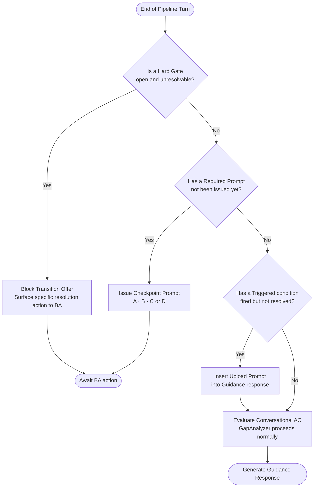

# Flow 06 — Upload Gate System

## What this covers

Each state transition has upload checkpoints enforced by the `GapAnalyzerAgent`. Upload gate evaluation runs before conversational AC — no transition offer can be made while an upload gate is open. Gates are classified into four types depending on how strictly they block progress.

**Key rule:** The order of gate evaluation is fixed: Hard Gates first → Required Prompts → Triggered conditions → then Conversational AC. Offering a transition before all gates are resolved is a pipeline error.

## Important Components

| Component | Role |
|---|---|
| Upload AC Registry | 16 named upload rules across all six transitions |
| Checkpoint prompts A, B, C, D | Pre-written templates issued at designated transitions |
| REQUIRED PROMPT tracker | Records whether each checkpoint prompt has been issued and responded to |
| TRIGGERED detector | Scans BA messages for references to existing documents |
| HARD GATE evaluator | Blocks the transition offer when a hard condition is unmet |
| Waiver recorder | Stores explicit BA skips (`memory_only_waiver`, `compliance_doc_waiver`) |

## Gate Types

| Type | Behaviour | Can BA skip? |
|---|---|---|
| **HARD GATE** | Blocks transition — unresolvable without action | No |
| **REQUIRED PROMPT** | System must issue the prompt before the transition offer; BA may skip | Yes — skip recorded |
| **TRIGGERED** | Fires when BA references an existing document | Yes — confidence metadata adjusted |
| **RECOMMENDED** | Offered once | Yes — no impact |

## Input → Process → Output

- **Input:** End of every pipeline turn, before Guidance Generator runs
- **Process:** Hard gates → required prompts → triggered conditions → conversational AC
- **Output:** Correct upload prompt inserted into guidance response, or transition offer unblocked

## Diagram

## Upload AC by Transition

| AC ID | Transition | Type | Hard Block? |
|---|---|---|---|
| AC-S1-U1 | PROBLEM_INTAKE → STAKEHOLDER_DISCOVERY | TRIGGERED | No — entities downgraded to trust tier 4 |
| AC-S2-U1 | STAKEHOLDER_DISCOVERY → REQUIREMENT_ELICITATION | REQUIRED PROMPT | Prompt must be issued; BA may skip |
| AC-S2-U2 | STAKEHOLDER_DISCOVERY → REQUIREMENT_ELICITATION | TRIGGERED | No — actor flagged `[UNVERIFIED]` |
| AC-S3-U1 | REQUIREMENT_ELICITATION → CONSTRAINT_CAPTURE | REQUIRED PROMPT | Prompt must be issued; BA may skip |
| AC-S3-U2 | REQUIREMENT_ELICITATION → CONSTRAINT_CAPTURE | HARD GATE | Must upload OR record waiver (regulated domains) |
| AC-S3-U3 | REQUIREMENT_ELICITATION → CONSTRAINT_CAPTURE | TRIGGERED | No — confidence modifier −0.10 applied |
| AC-S4-U1 | CONSTRAINT_CAPTURE → ARCHITECTURE_ALIGNMENT | REQUIRED PROMPT | Prompt must be issued; BA may skip |
| AC-S4-U2 | CONSTRAINT_CAPTURE → ARCHITECTURE_ALIGNMENT | HARD GATE (soft) | Must upload OR waiver; constraints flagged |
| AC-S5-U1 | ARCHITECTURE_ALIGNMENT → REVIEW_AND_SIGN_OFF | TRIGGERED HARD GATE | First decision question withheld until resolved |
| AC-S6-U1 | REVIEW_AND_SIGN_OFF → SIGNED_OFF | HARD GATE | BRD artifact must exist with valid storage URI |
| AC-S6-U2 | REVIEW_AND_SIGN_OFF → SIGNED_OFF | HARD GATE | HLD artifact must exist with valid storage URI |
| AC-S6-U4 | REVIEW_AND_SIGN_OFF → SIGNED_OFF | HARD GATE | Client signature token must be burned |

---

> Chitragupt · Flow 06 of 11 · May 2026
