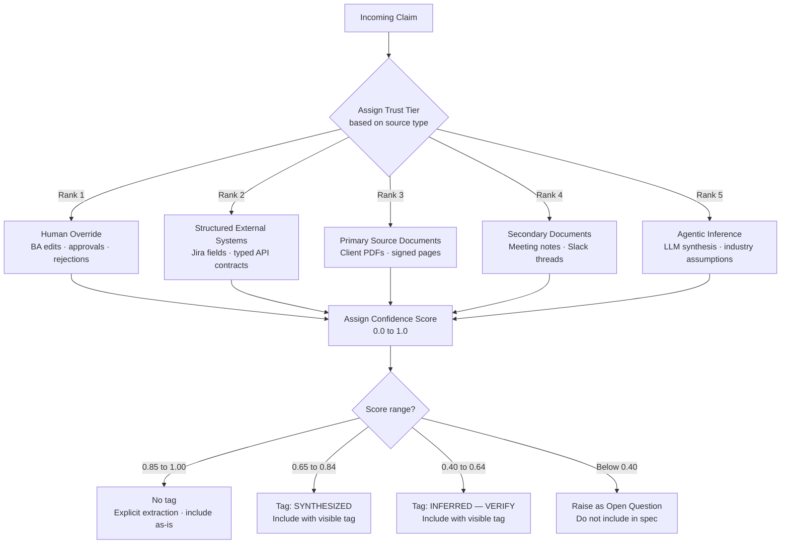

# Flow 07 — Trust Hierarchy and Confidence Scoring

## What this covers

Every piece of extracted knowledge is tagged with two values: a **trust tier** (how reliable the source is) and a **confidence score** (how certain the extraction is). When two sources conflict, the higher trust tier always wins automatically. Claims below a confidence threshold appear with visible warning tags in the final BRD — or are dropped entirely as Open Questions.

**Key rule:** Rank 5 (Agentic Inference) may never supersede or silently replace Rank 3+ claims. Silent merging across tiers is prohibited.

## Important Components

| Component | Role |
|---|---|
| Trust tiers 1–5 | Assigned per source type at ingestion time |
| Confidence score (0.0–1.0) | Computed by the extraction agent per claim |
| Confidence tags | `[SYNTHESIZED]`, `[INFERRED — VERIFY]` — visible in BRD output |
| Orphan Knowledge rule | Any LLM claim with no matching chunk is raised as an Open Question |
| Visual extraction cap | All image/diagram extractions are hard-capped at 0.80 confidence |

## Trust Tier Reference

| Rank | Source | Examples |
|---|---|---|
| 1 | Human Override | BA inline edits, approvals, rejections |
| 2 | Structured External Systems | Jira fields, typed API contracts, database schemas |
| 3 | Primary Source Documents | Client PDFs, signed Confluence pages, official emails |
| 4 | Secondary Documents | Meeting notes, Slack threads, internal memos |
| 5 | Agentic Inference | LLM synthesis, industry-standard assumptions |

## Input → Process → Output

- **Input:** A claim produced by any agent, along with its source document
- **Process:** Assign trust tier from source → score the extraction → tag or drop
- **Output:** Tagged requirement in session state, or Open Question raised for the BA

## Diagram

## Calibration Targets

| Metric | Target |
|---|---|
| Brier Score | < 0.15 vs. human expert review |
| ECE (Expected Calibration Error) | < 0.10 |
| Human rejection rate for claims scored > 0.85 | Must stay below 15% — recalibrate if exceeded |
| Visual extraction confidence cap | Hard cap at 0.80 regardless of LLM-reported score |

---

> Chitragupt · Flow 07 of 11 · May 2026
