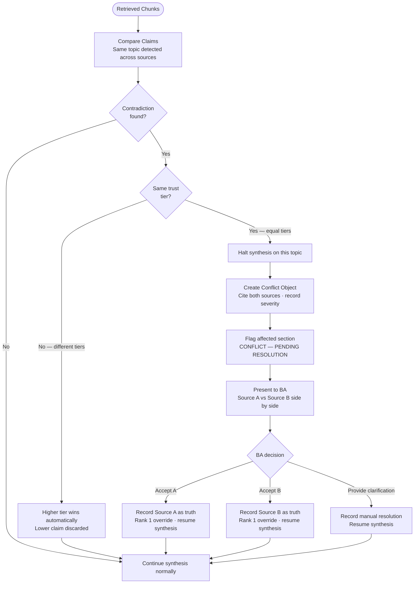

# Flow 08 — Conflict Detection and Resolution

## What this covers

When two retrieved chunks from sources of equal trust tier contradict each other on the same topic, the system halts synthesis on that topic and raises a Conflict object. It never guesses which source is correct. The BA must resolve it explicitly before the affected requirements can be finalized.

**Key rule (INV-EPI-02):** The agent may not unilaterally resolve conflicts between equal-tier sources. It must halt and raise a Conflict object. The human's choice becomes Rank 1 (human override) truth for that topic.

## Important Components

| Component | Role |
|---|---|
| `Conflict` entity | Stores both source citations, severity, and affected requirements |
| Conflict status | `open`, `resolved_a`, `resolved_b`, `resolved_manual`, `escalated` |
| HITL authority | BA resolution becomes Rank 1 truth — immutable thereafter |
| `[CONFLICT — PENDING RESOLUTION]` tag | Visible flag in BRD until resolved |
| AC-S6-3 | All Conflict objects must have `status = resolved_*` before sign-off |

## Conflict Severity Levels

| Severity | Meaning |
|---|---|
| `low` | Affects a non-critical section; does not block transition |
| `medium` | Should be resolved before sign-off |
| `high` | Blocks the affected requirement from being finalized |
| `blocking` | Blocks the entire BRD approval until resolved |

## Input → Process → Output

- **Input:** Two retrieved chunks from same-tier sources that contradict on a topic
- **Process:** Detect → create Conflict object → flag → present to BA → apply resolution
- **Output:** BA resolution recorded as Rank 1 truth; synthesis resumes on the affected topic

## Diagram



## Conflict Object Fields

```
conflict_id         · project_id          · conflict_type
source_a_chunk_id   · source_b_chunk_id   · affected_requirements
status              · resolution          · resolved_by
severity            · resolved_at
```

`conflict_type` values: `direct_contradiction` · `scope_overlap` · `version_conflict` · `implicit_contradiction`

---

> Chitragupt · Flow 08 of 11 · May 2026
