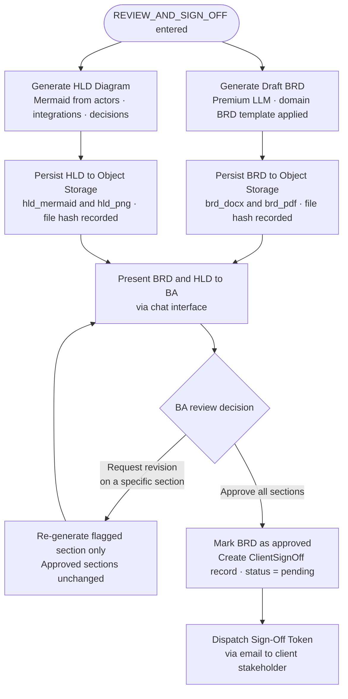

# Flow 09 — BRD and HLD Generation

## What this covers

When the session reaches REVIEW_AND_SIGN_OFF, two artifacts are generated in parallel: a structured Business Requirements Document (BRD) assembled from all confirmed requirements, and a High-Level Architecture Diagram (HLD) derived from the identified actors, integrations, and system components.

The BA reviews both in the chat interface and can request targeted revisions — only the flagged sections are re-generated; approved sections are never touched again.

**Key rules (AC-S6-U1, AC-S6-U2):** Both the BRD and HLD must be successfully generated and persisted to object storage with a valid `file_hash` before the BA can approve. A failed generation blocks approval.

## Important Components

| Component | Role |
|---|---|
| `BRDWriterAgent` | Premium LLM — assembles requirements into a structured BRD using the domain template |
| `HLDGeneratorAgent` | Derives Mermaid component diagram from actors, integrations, and decisions |
| `BRDTemplate` | Domain-specific template (e.g., Fintech Payments BRD) |
| `ExportArtifact` | Persisted record with `storage_uri` and `file_hash` per artifact |
| `ClientSignOff` | Created with `status = pending` when BA approves; triggers token dispatch |
| HITL authority | BA section approvals are immutable — only flagged sections are revised |

## Artifact Types

| Artifact | Format | Description |
|---|---|---|
| `brd_docx` | DOCX | Full Business Requirements Document |
| `brd_pdf` | PDF | PDF render of the BRD |
| `hld_mermaid` | Mermaid source | High-Level Architecture Diagram (source) |
| `hld_png` | PNG | Rendered diagram image |

## Input → Process → Output

- **Input:** All confirmed requirements, constraints, actors, and decision directions from the session
- **Process:** Generate BRD + HLD → persist → present → BA reviews → approve or revise sections
- **Output:** Approved artifacts in object storage; `ClientSignOff` record created with `status = pending`

## Diagram

## BRD Sections (Standard Template)

| Section | Source |
|---|---|
| Executive Summary | Synthesized from problem statement |
| Stakeholders | Actor registry |
| Functional Requirements | Requirements with `type = functional` |
| Non-Functional Requirements | Requirements with `type = non_functional` |
| Constraints and Assumptions | Constraint and Assumption registers |
| Open Questions | Unresolved Gap objects |
| Traceability Matrix | Chunk → Requirement mapping |

---

> Chitragupt · Flow 09 of 11 · May 2026
