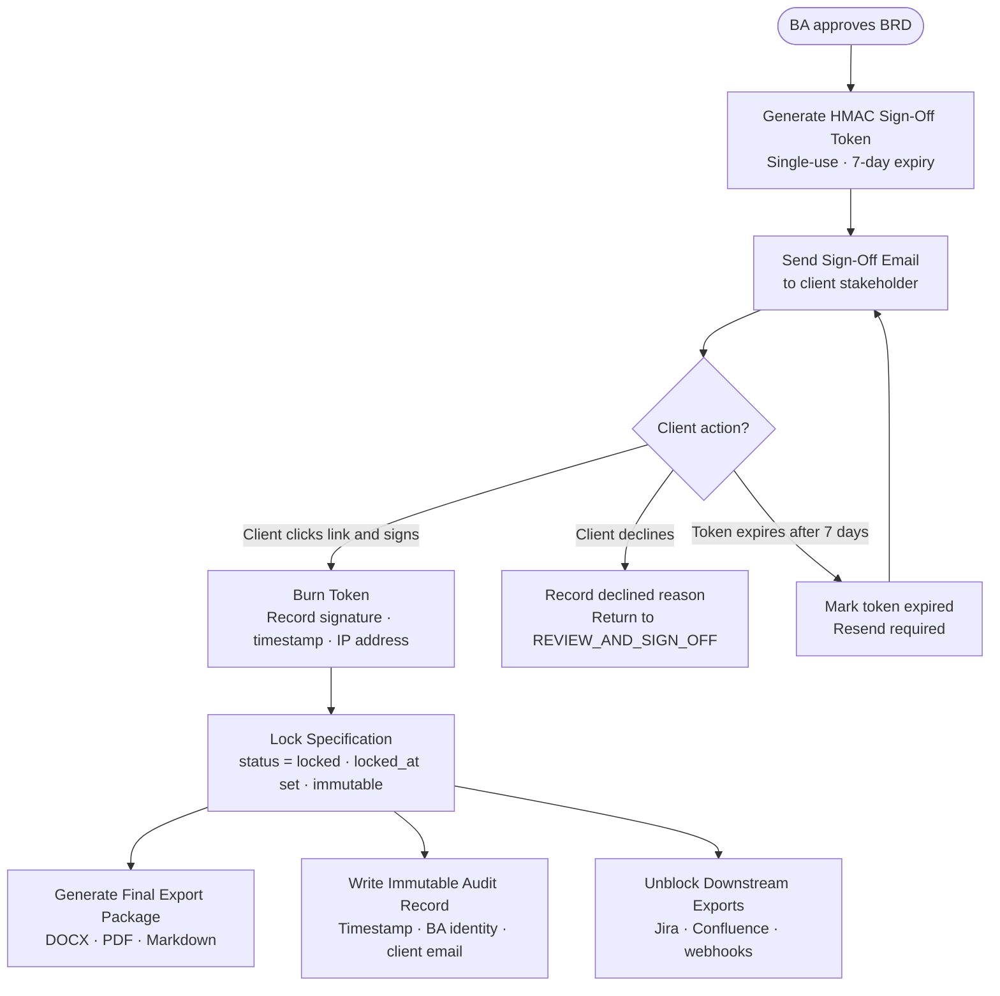

# Flow 10 — Client Sign-Off and Spec Lock

## What this covers

After the BA approves the BRD, a single-use HMAC token is sent to the client stakeholder via email. When the client clicks the sign-off link and signs, the token is burned and the Specification is permanently locked. No further automated changes are possible after locking — any change requires creating a new version.

**Key rule (INV-HITL-05):** A locked specification is immutable. No automated modification is permitted. Changes after locking require creating a new specification version.

**Key rule (AC-S6-U4):** `SIGNED_OFF` state is unreachable until `ClientSignOff.status = signed`. A `status = pending` record is necessary but not sufficient.

## Important Components

| Component | Role |
|---|---|
| `ClientSignOff` entity | Tamper-evident record with signature token, signed_at, and IP address |
| HMAC token | Single-use, 7-day expiry; burned on first click (cannot be reused) |
| Spec lock | Sets `Specification.status = locked` and `locked_at`; immutable thereafter |
| Audit log | Append-only record of sign-off event — cannot be modified or deleted (INV-SEC-04) |
| Downstream unblock | Jira, Confluence, and webhook exports gated until `status = signed` (INV-HITL-02) |

## Sign-Off Methods

| Method | Description |
|---|---|
| `email_link` | Client clicks a link in the sign-off email |
| `in_app` | Client approves directly within the Chitragupt interface |
| `wet_signature_upload` | Scanned signature document uploaded by the BA |

## Input → Process → Output

- **Input:** BA BRD approval
- **Process:** Generate HMAC token → send email → await client action → burn token → lock spec
- **Output:** Locked, exported specification with immutable audit record; downstream exports unblocked

## Diagram



## ClientSignOff Entity Fields

```
sign_off_id             · spec_id               · artifact_id
project_id              · tenant_id             · signed_by_stakeholder_id
signed_by_email         · signed_at             · signature_token
token_expires_at        · sign_off_method       · status
declined_reason         · ip_address
```

**Effect of `status = signed`:**
- `Specification.status → locked`
- `Specification.client_sign_off_id` set
- `Specification.locked_at` set
- No UPDATE operations permitted on the Specification or its Requirements thereafter

---

> Chitragupt · Flow 10 of 11 · May 2026
