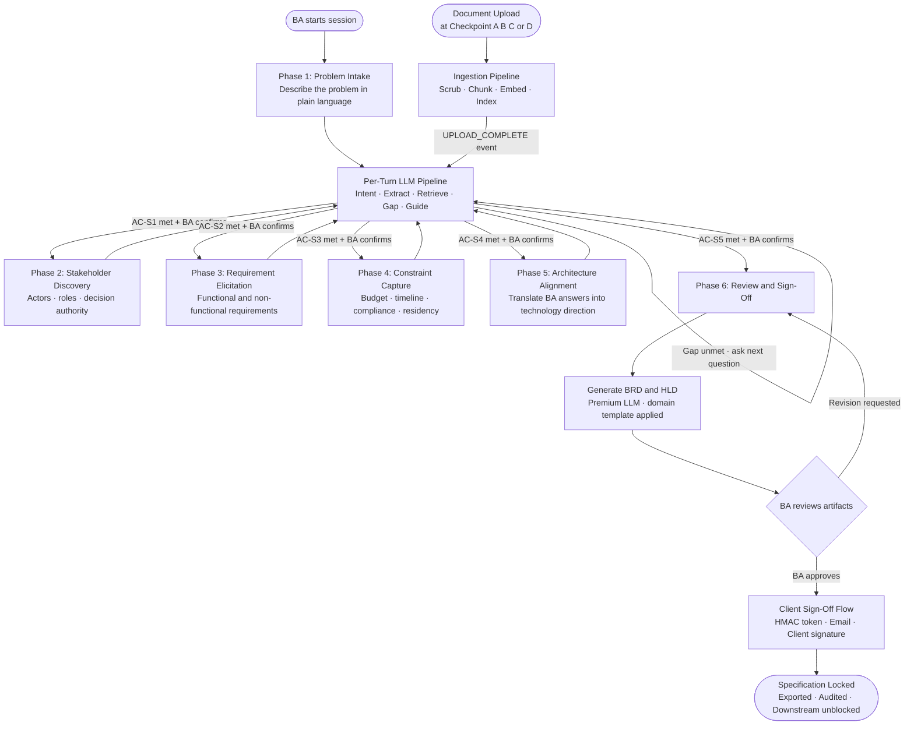

# Flow 11 — Complete High-Level Flow

## What this covers

This is the full end-to-end picture — all modules working together, from a BA opening a new session to a locked, client-signed specification ready for delivery.

Each numbered flow document covers one module in depth. This diagram shows how they connect.

## Module Map

| Flow | Module |
|---|---|
| [Flow 01](flow-01-system-overview.md) | System Overview |
| [Flow 02](flow-02-session-state-machine.md) | BA Session State Machine |
| [Flow 03](flow-03-per-turn-pipeline.md) | Per-Turn LLM Pipeline |
| [Flow 04](flow-04-document-ingestion.md) | Document Ingestion Pipeline |
| [Flow 05](flow-05-rag-retrieval.md) | RAG Retrieval Flow |
| [Flow 06](flow-06-upload-gates.md) | Upload Gate System |
| [Flow 07](flow-07-trust-hierarchy.md) | Trust Hierarchy and Confidence Scoring |
| [Flow 08](flow-08-conflict-resolution.md) | Conflict Detection and Resolution |
| [Flow 09](flow-09-brd-hld-generation.md) | BRD and HLD Generation |
| [Flow 10](flow-10-client-signoff.md) | Client Sign-Off and Spec Lock |

## Input → Process → Output

- **Input:** A BA with a business problem and (optionally) a set of documents
- **Process:** Seven guided phases with AI extraction, retrieval, gap analysis, and conflict resolution
- **Output:** Locked, client-signed BRD and HLD exported in DOCX, PDF, and Markdown formats

## Diagram

## Key System Rules (Summary)

| Rule | Description |
|---|---|
| INV-SEC-01 | Every vector query must include `tenant_id` filter — no exceptions |
| INV-SEC-02 | PII is scrubbed before embedding, never after |
| INV-EPI-01 | Every requirement must have at least one source chunk — no orphan knowledge in the spec |
| INV-EPI-02 | Agent may not resolve equal-tier conflicts — must halt and raise a Conflict object |
| INV-HITL-01 | Human edits are absolute ground truth — system may not overwrite them |
| INV-HITL-02 | No generated artifact is pushed downstream without explicit human approval |
| INV-HITL-05 | A locked specification is immutable — changes require a new version |
| INV-COST-01 | When project budget cap is reached, all agent tasks stop until cap is raised |

---

> Chitragupt · Flow 11 of 11 · May 2026
