# Chitragupt — Project Flow Documentation

> **Who this is for:** Anyone new to Chitragupt who wants to understand how the system works without reading all the technical specs.
> Each section covers one module — what it does, a simple diagram, and what goes in and comes out.

---

## Table of Contents

1. [System Overview](#1-system-overview)
2. [BA Session State Machine](#2-ba-session-state-machine)
3. [Per-Turn LLM Pipeline](#3-per-turn-llm-pipeline)
4. [Document Ingestion Pipeline](#4-document-ingestion-pipeline)
5. [RAG Retrieval Flow](#5-rag-retrieval-flow)
6. [Upload Gate System](#6-upload-gate-system)
7. [Trust Hierarchy and Confidence Scoring](#7-trust-hierarchy-and-confidence-scoring)
8. [Conflict Detection and Resolution](#8-conflict-detection-and-resolution)
9. [BRD and HLD Generation](#9-brd-and-hld-generation)
10. [Client Sign-Off and Spec Lock](#10-client-sign-off-and-spec-lock)
11. [Complete High-Level Flow](#11-complete-high-level-flow)

---

## 1. System Overview

Chitragupt is an AI-powered Business Requirement Analyzer. A Business Analyst (BA) opens a chat session and is guided through seven structured phases — from describing a business problem to producing a signed-off Business Requirements Document (BRD) and High-Level Architecture Diagram (HLD).

**Important components involved:**
- BA Chat Interface — the only way the BA interacts with the system
- LangGraph State Machine — tracks which phase the session is in
- LLM Agent Pipeline — the reasoning engine behind every response
- RAG Pipeline — retrieves relevant content from uploaded documents
- PostgreSQL + pgvector — stores all session data, entities, and embeddings
- Export Engine — generates the final BRD and HLD artifacts

**Input → Process → Output:**
- **Input:** BA messages and document uploads
- **Process:** Structured, phase-by-phase guided conversation with AI extraction
- **Output:** Signed-off BRD (DOCX/PDF) and HLD diagram (Mermaid/PNG)

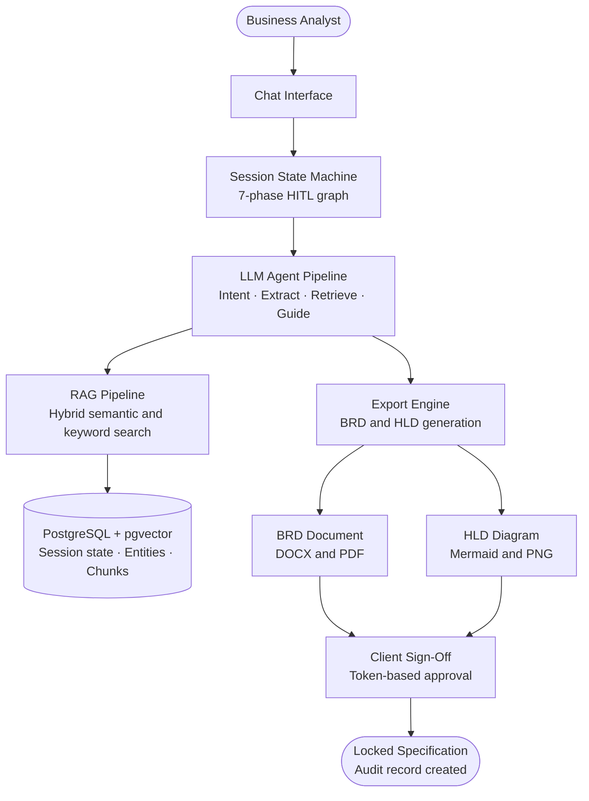

---

## 2. BA Session State Machine

The session advances through seven phases in order. The BA can never be moved forward automatically — every transition requires the BA to explicitly confirm. The BA can also revisit any prior phase at any time without losing what was already captured.

**Important components involved:**
- `SessionState` — the typed object that holds all captured data
- `TransitionHandler` — proposes transitions and waits for BA confirmation
- Acceptance Criteria (AC) — discrete, checkable conditions that must all pass before a transition is offered
- REVISIT handler — re-enters a prior state and resumes from the last unmet criterion

**Input → Process → Output:**
- **Input:** BA natural language messages and confirmation responses
- **Process:** AC evaluation after every turn; transition offer only when all AC pass
- **Output:** Session advances to the next state; all captured data is persisted

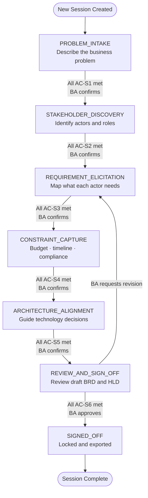

---

## 3. Per-Turn LLM Pipeline

Every message the BA sends triggers a six-step pipeline before a response is generated. No step can be skipped. The final output always ends with exactly one clear action for the BA — a question, a confirmation prompt, or a transition offer. The BA should never wonder "what do I do next?"

**Important components involved:**
- `IntentClassifierAgent` — Fast LLM, classifies what the BA meant (target: < 200ms)
- `EntityExtractorAgent` — Standard LLM, pulls structured data from the BA's words
- `RAGRetrievalAgent` — Hybrid search over all uploaded documents in the session
- `GapAnalyzerAgent` — Standard LLM, checks which acceptance criteria are still unmet
- `GuidanceGeneratorAgent` — Premium LLM, composes the final response (streamed)

**Input → Process → Output:**
- **Input:** Any BA message (answer, confirmation, correction, upload signal, revisit request, skip)
- **Process:** Intent classification → entity handling → retrieval → gap check → response generation
- **Output:** Streamed system message: acknowledge + captured bullets + one next action

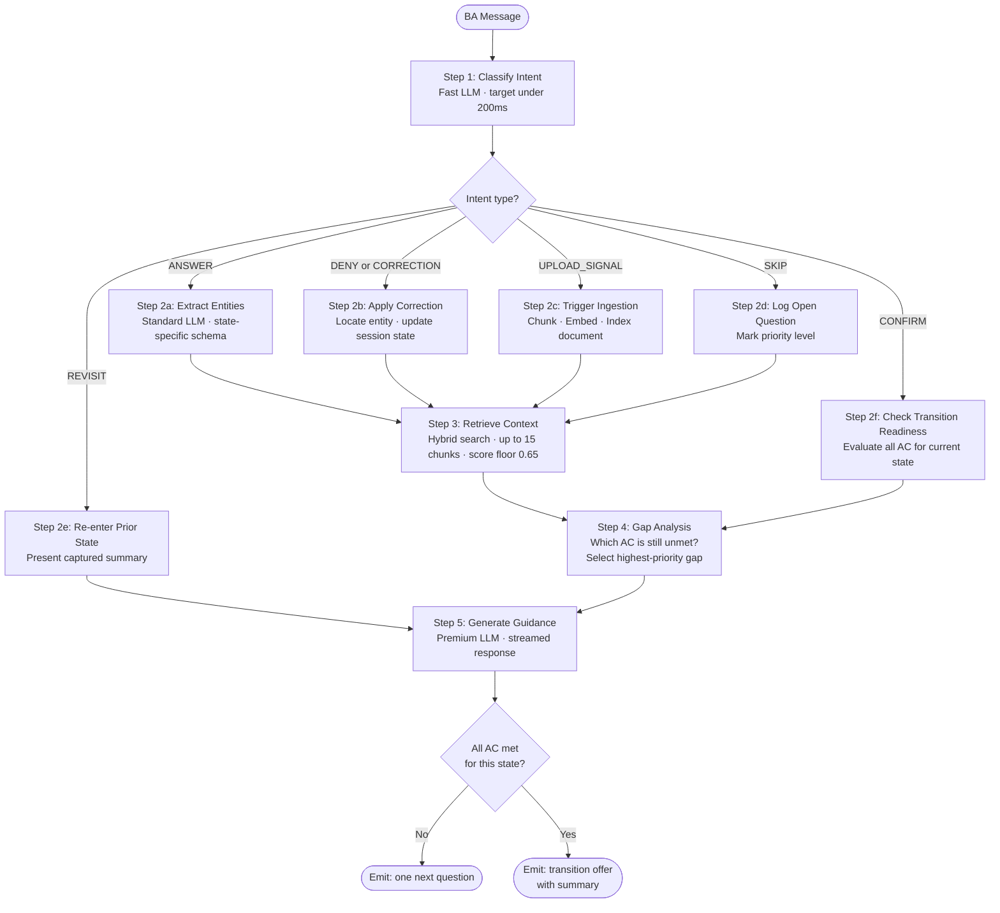

---

## 4. Document Ingestion Pipeline

When a BA uploads a document at any checkpoint, it passes through a processing pipeline before its content becomes searchable. PII scrubbing always happens before embedding — never after. Every chunk is tagged with the tenant and project IDs to enforce data isolation.

**Important components involved:**
- Object Storage — raw files stored at `s3://{tenant_id}/{project_id}/`
- PII Scrubber — redacts personal identifiers before any embedding call
- Chunker — splits documents into 512-token overlapping windows
- Embedding Model — converts text to dense 1536-dimension vectors
- pgvector — stores chunks with both dense and sparse (BM25) vectors
- `UPLOAD_COMPLETE` event — fires after successful indexing; triggers AC re-evaluation

**Input → Process → Output:**
- **Input:** Raw uploaded file (PDF, DOCX, image, spreadsheet, audio, etc.)
- **Process:** Store → Scrub PII → Chunk → Embed → Index → Notify
- **Output:** Searchable chunks available for retrieval; upload acceptance criteria re-evaluated

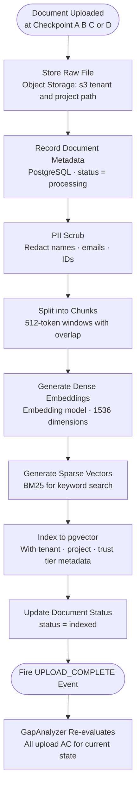

---

## 5. RAG Retrieval Flow

From the STAKEHOLDER_DISCOVERY phase onward, every turn includes a retrieval step. The system builds a query from the current session state and extracted entities, runs it against both dense and sparse indexes, fuses the results, filters by mandatory criteria, and re-ranks before returning chunks to the pipeline.

**Important components involved:**
- State-specific query templates — different query patterns per session phase
- Dense search — vector cosine similarity against `pgvector`
- Sparse search — BM25 keyword matching
- RRF fusion — Reciprocal Rank Fusion combines both result sets
- Cross-encoder re-ranker — orders final results by relevance
- Mandatory filters — `tenant_id`, `project_id`, `is_active`, `valid_until`

**Input → Process → Output:**
- **Input:** Current session state + entities extracted this turn
- **Process:** Build query → dual-path search → fuse → filter → floor → re-rank
- **Output:** Up to 15 ranked chunks with source metadata, passed to GapAnalyzer and GuidanceGenerator

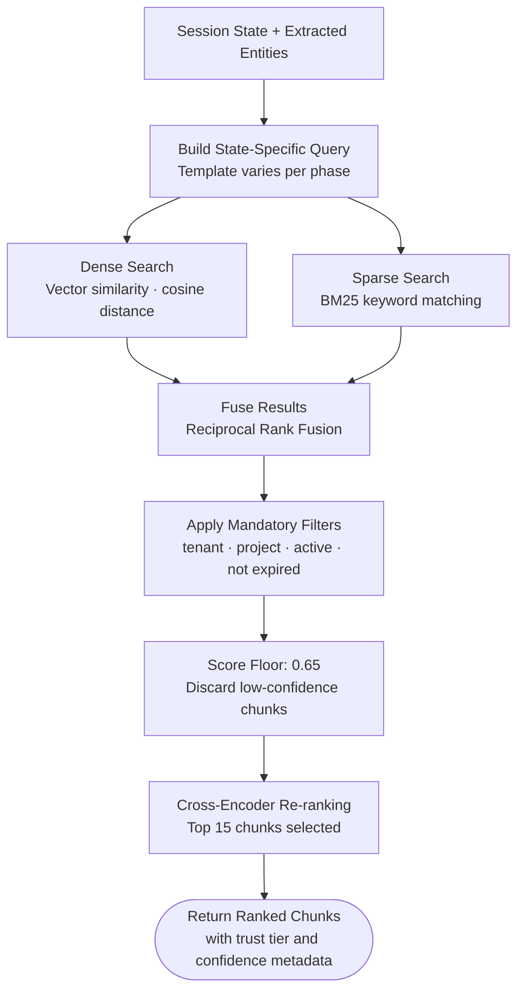

**State-specific query patterns:**

| Phase | Query template |
|---|---|
| STAKEHOLDER_DISCOVERY | `{problem_statement} stakeholders actors roles responsibilities` |
| REQUIREMENT_ELICITATION | `{actor_name} needs requirements workflows` — one query per actor |
| CONSTRAINT_CAPTURE | `budget timeline compliance regulatory constraints {domain}` |
| ARCHITECTURE_ALIGNMENT | `{decision_id} {constraint_summary} {compliance_flags}` |
| REVIEW_AND_SIGN_OFF | `{requirement_description} {source_chunk_ids}` — re-retrieval for BRD grounding |

---

## 6. Upload Gate System

Each state transition has upload checkpoints enforced by the `GapAnalyzerAgent`. Gates are classified into four types. The gate evaluation runs before conversational AC — no transition offer can be made while a gate is open.

**Important components involved:**
- Upload AC Registry — 16 named upload rules across all six transitions
- Checkpoint prompts A, B, C, D — pre-written templates issued at designated transitions
- REQUIRED PROMPT tracker — records whether each checkpoint prompt has been issued
- TRIGGERED detector — scans BA messages for references to existing documents
- HARD GATE evaluator — blocks the transition offer when a hard condition is unmet
- Waiver recorder — stores explicit BA skips (`memory_only_waiver`, `compliance_doc_waiver`)

**Input → Process → Output:**
- **Input:** End of every pipeline turn
- **Process:** Check hard gates → check required prompts → check triggered conditions → then conversational AC
- **Output:** Correct upload prompt inserted into guidance, or transition offer unblocked

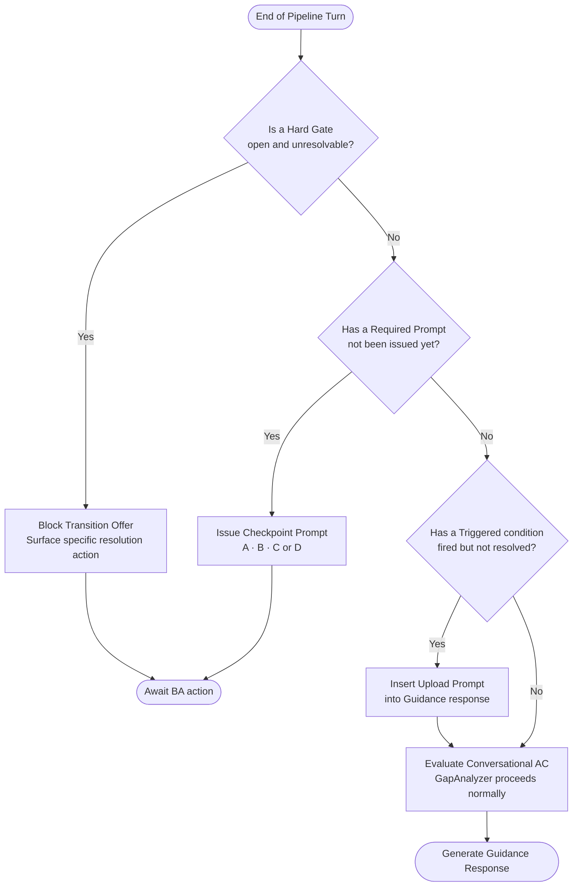

**Gate type reference:**

| Type | Behavior | Can BA skip? |
|---|---|---|
| HARD GATE | Blocks transition — unresolvable without action | No |
| REQUIRED PROMPT | Must be issued before transition offer | Yes — system records skip |
| TRIGGERED | Fires when BA references an existing document | Yes — confidence metadata adjusted |
| RECOMMENDED | Offered once | Yes — no impact |

---

## 7. Trust Hierarchy and Confidence Scoring

Every piece of extracted knowledge is tagged with two values: a **trust tier** (how reliable the source is) and a **confidence score** (how certain the extraction is). When two sources conflict, the higher trust tier always wins. Claims below a confidence threshold appear with visible tags in the final BRD.

**Important components involved:**
- Trust tiers 1–5 — assigned per source type at ingestion time
- Confidence score (0.0–1.0) — computed by the extraction agent
- Confidence tags — `[SYNTHESIZED]`, `[INFERRED — VERIFY]` — visible in the BRD output
- Orphan Knowledge rule — any LLM claim with no matching chunk is raised as an Open Question, never included as a confirmed requirement

**Input → Process → Output:**
- **Input:** A claim produced by any agent, with its source document
- **Process:** Assign tier → score → tag → include or raise as open question
- **Output:** Tagged requirement or open question, stored in session state

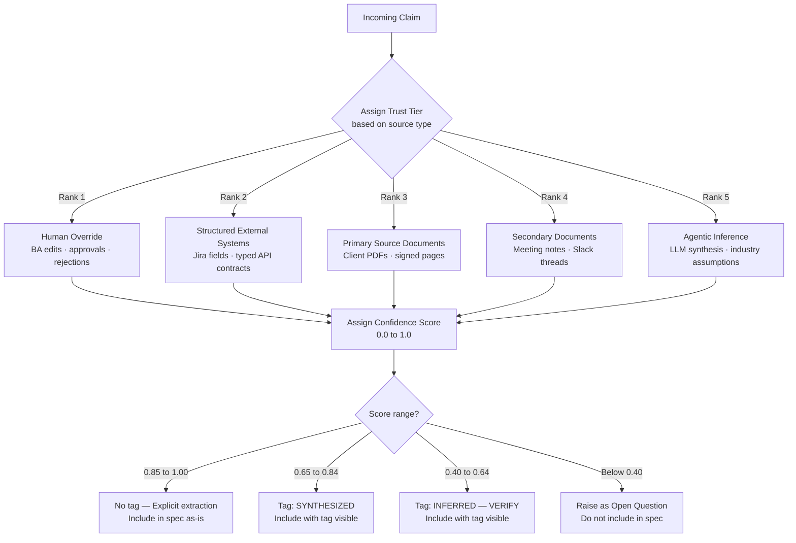

---

## 8. Conflict Detection and Resolution

When two retrieved chunks from sources of equal trust tier contradict each other on the same topic, the system halts synthesis and raises a Conflict object. It never guesses which source is correct. The BA must resolve it before the affected requirements can be finalized.

**Important components involved:**
- `Conflict` entity — stores both source citations and the affected requirements
- Conflict status — `open`, `resolved_a`, `resolved_b`, `resolved_manual`, `escalated`
- HITL authority — the BA's resolution becomes Rank 1 (human override) truth for that topic
- Conflict flag in BRD — `[CONFLICT — PENDING RESOLUTION]` tag visible until resolved

**Input → Process → Output:**
- **Input:** Two retrieved chunks from same-tier sources that contradict on a topic
- **Process:** Create Conflict object → flag → present to BA → apply resolution
- **Output:** BA resolution recorded as Rank 1 truth; synthesis resumes

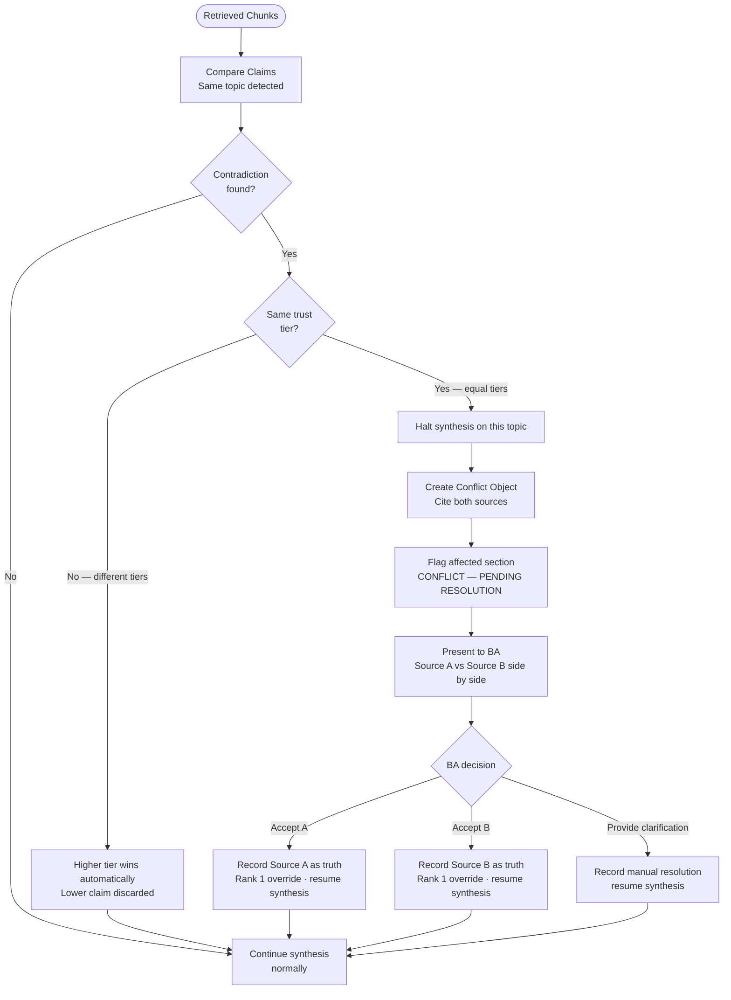

---

## 9. BRD and HLD Generation

When the session reaches REVIEW_AND_SIGN_OFF, two artifacts are generated in parallel: a structured Business Requirements Document assembled from all confirmed requirements, and a High-Level Architecture Diagram derived from the identified actors, integrations, and system components. The BA reviews both in the chat interface and can request targeted revisions — approved sections are never regenerated.

**Important components involved:**
- `BRDWriterAgent` — Premium LLM, applies the domain BRD template to confirmed requirements
- `HLDGeneratorAgent` — derives component diagram from actors, integrations, and decisions
- `ExportArtifact` records — `brd_docx`, `brd_pdf`, `hld_mermaid`, `hld_png` with `file_hash` and `storage_uri`
- HITL authority — BA section approvals are immutable; only flagged sections are revised

**Input → Process → Output:**
- **Input:** All confirmed requirements, constraints, actors, and decision directions from the session
- **Process:** Generate BRD + HLD → persist → present → BA reviews → approve or revise
- **Output:** Approved BRD and HLD artifacts persisted to object storage; `ClientSignOff` record created

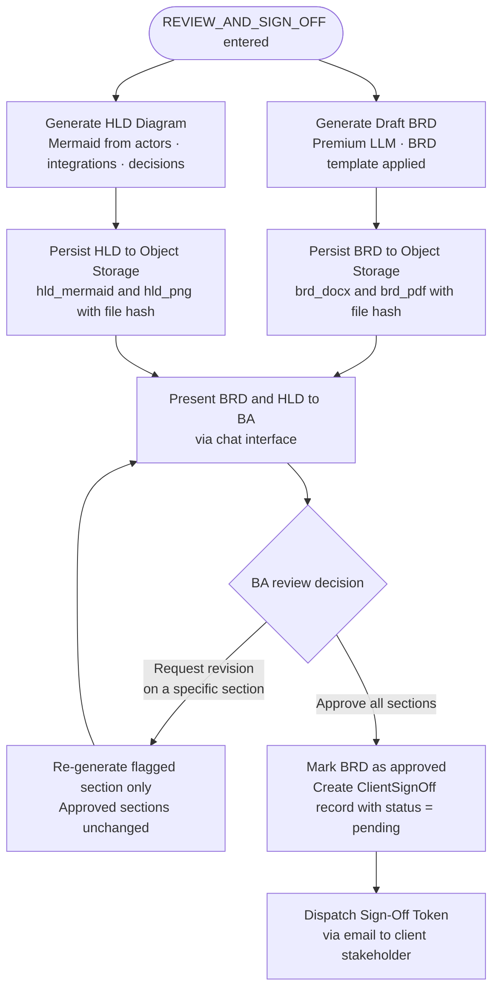

---

## 10. Client Sign-Off and Spec Lock

After the BA approves the BRD, a single-use HMAC token is sent to the client stakeholder. When the client clicks the link and signs, the token is burned and the Specification is permanently locked — no further automated changes are possible. Any change after locking requires creating a new version.

**Important components involved:**
- `ClientSignOff` entity — tamper-evident record with `signature_token`, `signed_at`, and IP address
- HMAC token — single-use, 7-day expiry; burned on first click
- Spec lock — sets `Specification.status = locked` and `locked_at`; immutable thereafter
- Audit log — append-only record of the sign-off event; cannot be modified or deleted
- Downstream unblock — Jira, Confluence, and webhook exports are gated until `status = signed`

**Input → Process → Output:**
- **Input:** BA BRD approval
- **Process:** Generate token → send email → await client action → burn token → lock spec
- **Output:** Locked, exported specification with immutable audit record; downstream exports unblocked

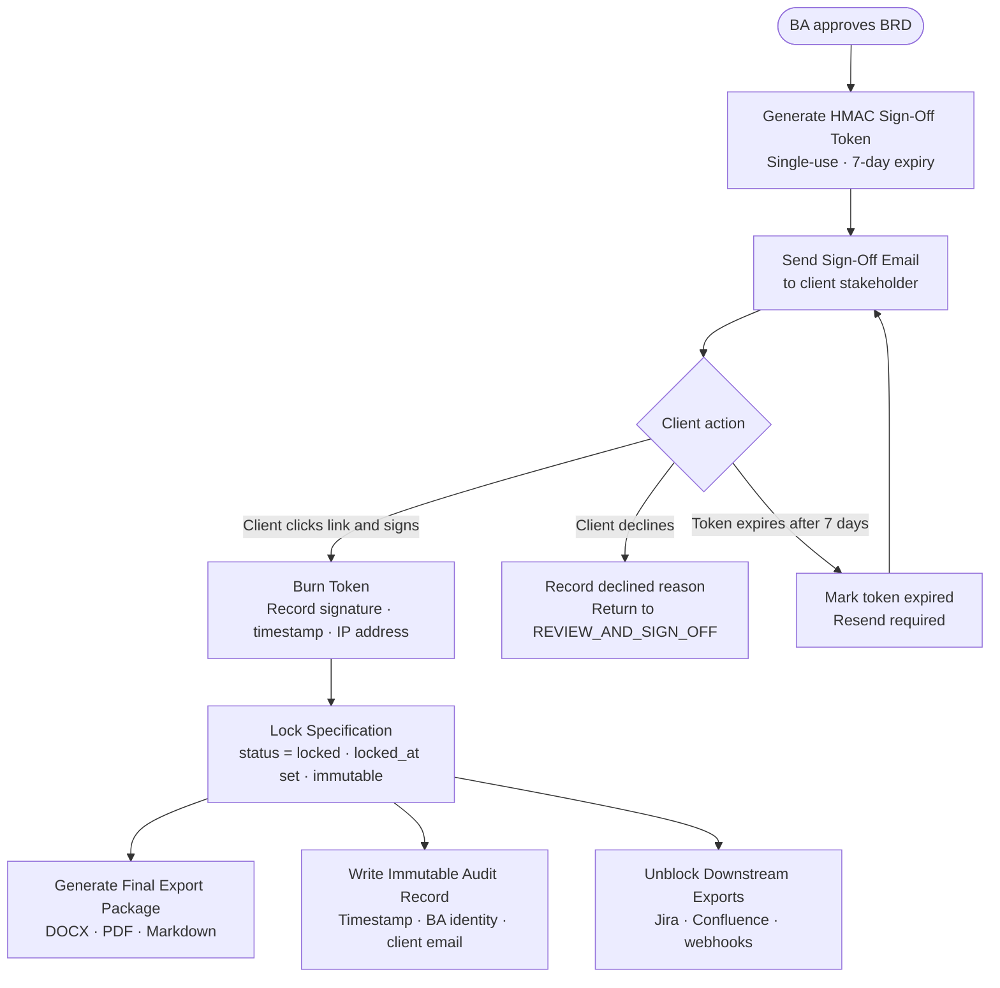

---

## 11. Complete High-Level Flow

All modules working together — from a BA opening a new session to a locked, client-signed specification ready for delivery.

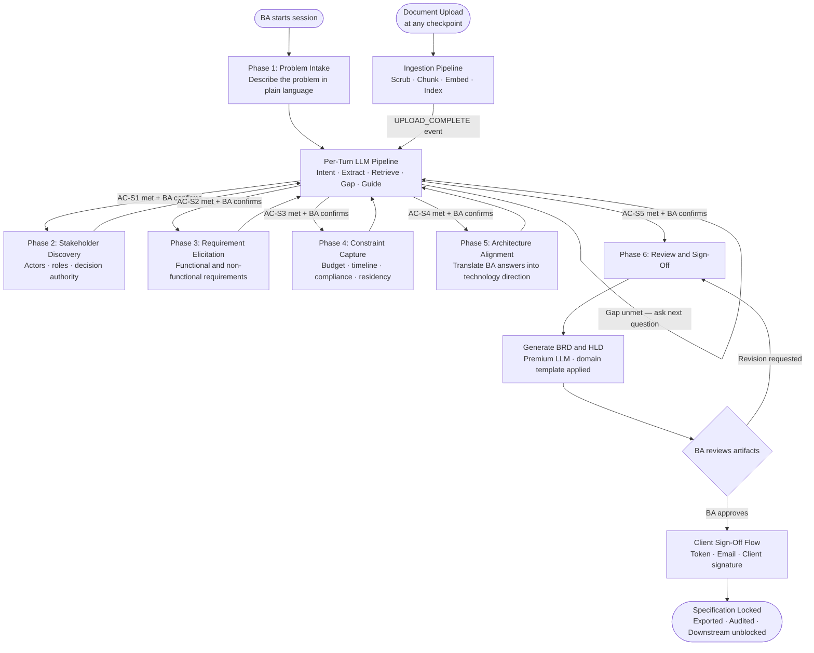

---

> Chitragupt Flow Documentation · Sprint 0 and Sprint 1 · May 2026
