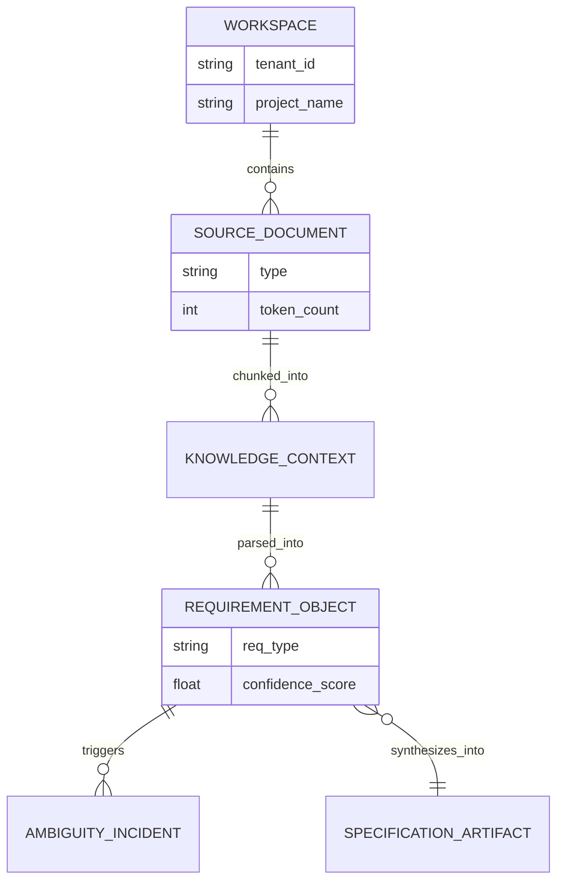

# Chitragupt Discovery Phase 1: Foundational Principles

This document establishes the foundational philosophy, structural models, and operational boundaries for the Chitragupt Business Requirement Analyzer (BRA). It serves as the master reference for the product and engineering teams before technical development begins.

---

## 1. Epistemology (Theory of Knowledge)

Before we can build an agentic system that analyzes requirements, we must define how the system establishes "truth" and what constitutes valid knowledge.

### 1.1 Grounded Truth vs. Latent Knowledge
Chitragupt operates on a strictly **Closed-World Epistemology**. 
- **Latent Knowledge (Discarded):** The LLM's pre-trained knowledge about business analysis, generic software patterns, or external facts is NOT considered "truth."
- **Grounded Truth (Accepted):** The only valid truth in the system is what can be explicitly retrieved from the uploaded **Source Documents** via the Retrieval-Augmented Generation (RAG) pipeline.

### 1.2 Defining "Hallucination"
In Chitragupt, a hallucination is defined as: *Any generated requirement, constraint, or narrative that cannot trace its origin back to a specific semantic chunk (Knowledge Context) from a Source Document.*

### 1.3 The Arbiter of Truth
AI Agents in Chitragupt do not create final truth; they create **Proposals of Truth**. The ultimate arbiter of truth is the Human-in-the-Loop (the Business Analyst). A Specification Artifact only transitions from a "Proposed State" to "Ground Truth" upon explicit human validation.

---

## 2. Ontology (Domain Model)

The Ontology defines the entities that exist within the Chitragupt universe and how they relate to one another.

### 2.1 Core Entities
- **Workspace (Tenant):** The absolute boundary containing all data for a specific project or client.
- **Source Document:** The raw, unstructured input (PDF, DOCX, email thread).
- **Knowledge Context (Chunk):** A vectorized, semantically meaningful segment of a Source Document.
- **Requirement Object:** A structured data representation of a business need. Subtypes include: Functional, Non-Functional, Constraint, and Assumption.
- **Ambiguity Incident:** An explicit state triggered when an Agent detects conflicting, vague, or missing information within a Requirement Object.
- **Specification Artifact:** The final synthesized output (e.g., BRD, FRD, User Story, Gap Report).

### 2.2 Entity Relationship Map

---

## 3. Invariants and Unknowns

### 3.1 System Invariants
These are the non-negotiable laws of the Chitragupt system. If an invariant is broken, the system has failed.
1. **Absolute Traceability:** Every generated claim in a Specification Artifact MUST link back to at least one Knowledge Context citation.
2. **Mandatory Human Approval:** State changes from "Draft" to "Approved" require an explicit, auditable user action.
3. **Strict Isolation:** Data (embeddings, documents, memory) must never leak across Workspace boundaries.
4. **Graceful Fallback:** If an Agent's confidence falls below the defined threshold, it must halt generation and trigger an Ambiguity Incident rather than guessing.

### 3.2 Unknowns (To Be Discovered)
These represent our current technical and business risks that require resolution.
- **Data Contradiction:** How do Agents resolve or escalate when Page 2 of a Source Document directly contradicts Page 45?
- **Chunking Complex Data:** What is the optimal strategy for vectorizing dense spreadsheets and nested tables without losing structural context?
- **Clarification Fatigue:** What is the maximum acceptable number of Ambiguity Incidents (clarification questions) a Business Analyst will tolerate per session before abandoning the tool?
- **Template Rigidity:** How much flexibility do clients need in defining their own Specification Artifact formats vs. using Chitragupt's standard formats?

---

## 4. Stakeholder Input Requirements & Query Doc

To resolve our Unknowns and finalize the Sprint backlog, we require the following from our stakeholders.

### 4.1 Input Prerequisites (Collateral)
Before building the prompt templates and evaluation rubrics, the Product Team requires:
1. **Gold Standard Outputs:** 3 examples of excellent, approved BRDs/FRDs currently used in production.
2. **Raw Input Samples:** 5 examples of the messy, unstructured inputs (emails, meeting notes, rough PDFs) that were used to create those gold standard outputs.
3. **Compliance Checklists:** Any mandatory security, compliance, or regulatory checklists that must be applied to all requirements.

### 4.2 Discovery Interview Queries
Product managers must present these queries to the core stakeholders (BAs, PMs, Architects):

**Workflow & Pain Points:**
1. *When reviewing a draft requirements document, what are the top 3 most common errors or omissions you look for?*
2. *How do you currently track which stakeholder requested which requirement?*
3. *What is your current tolerance for AI formatting errors versus factual/logic errors?*

**Resolution & Edge Cases:**
4. *When you encounter contradictory requirements from two different client stakeholders, what is your standard resolution process?*
5. *If the AI presents you with 10 clarifying questions at once, is that helpful or overwhelming? Should they be batched or presented contextually?*

**Output & Integration:**
6. *Do your engineering teams require User Stories in a specific format (e.g., strictly INVEST/Gherkin), or is there flexibility?*
7. *What systems must Chitragupt integrate with for downstream consumption (e.g., push to JIRA, Confluence, Azure DevOps)?*
